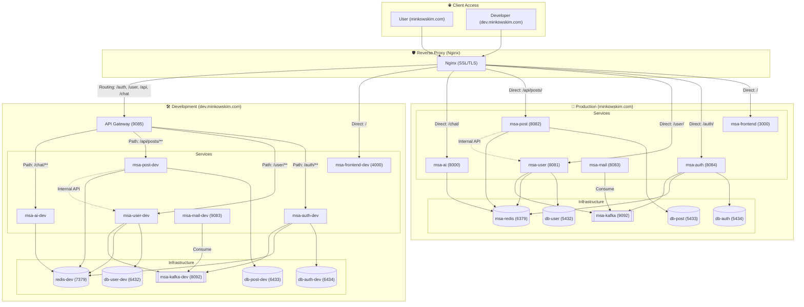

# 🚀 MSA 기반 풀스택 커뮤니티 & AI 플랫폼

  

### 📱 Frontend

### ⚙️ Backend

### 🗄️ Database & Cache

### 📨 Message Broker

### 🤖 AI & LLM

### ☁️ Infrastructure & DevOps

> **MSA(Microservice Architecture)**를 기반으로 설계된 고효율 시스템입니다.
> 도메인별 최적화된 프레임워크 선택과 보안 강화, 그리고 실시간 AI 챗봇 기능을 제공합니다.

🔗 **라이브 데모**: [https://minkowskim.com/](https://minkowskim.com/)

🔗 **개발 라이브 데모**: [https://dev.minkowskim.com/](https://dev.minkowskim.com/)

> ##### 현재 개발 진행 중: Dev서버 구축 및 API Gateway 구축 26.1.22

---

## 🏗️ System Architecture

본 프로젝트는 서비스 간 결합도를 낮추고 확장성을 높이기 위해 마이크로서비스 구조로 설계되었습니다.

- **Frontend**: Next.js (SEO 최적화 및 테마 시스템)
- **Auth Service**: Spring Boot (인증 및 보안)
- **User Service**: Spring Boot (유저 관리)
- **Post Service**: Spring Boot (게시글 관리)
- **Mail Service**: Spring Boot (메일 관리)
- **Chatbot Service**: FastAPI (AI 챗봇 엔진)
- **Infrastructure**: AWS Lightsail, Docker, Nginx

---

# 🏗️ System Architecture

프로젝트의 전체적인 마이크로서비스 구조 및 데이터 흐름도입니다.

---

## 🏛️ Architecture Diagram

## 🔥 Key Features

### 1. 보안 강화 유저 시스템 (User Domain)

- **Spring Boot & JWT**: JSON Web Token을 활용한 안전한 인증 체계.
- **HttpOnly Cookie**: 모든 로그인 및 토큰 시스템을 `HttpOnly` 설정으로 구축하여 XSS 공격으로부터 보안을 강화했습니다.

### 2. AI 챗봇 서비스 (Chatbot Domain)

- **FastAPI**: 빠르고 효율적인 비동기 처리 기반 AI 서버.
- **Redis 연동**: Redis를 활용하여 사용자의 이전 대화 기록을 저장하고 맥락이 끊기지 않는 이어가기 기능을 제공합니다.

### 3. 고성능 프론트엔드 (Frontend)

- **Next.js**: SSR/SSG를 통한 **SEO(검색 엔진 최적화)** 구현.
- **다크 모드 & 화이트 모드**: 전 페이지 테마 전환 시스템 도입으로 UX 최적화.
- **Responsive UI**: 모든 기기에 대응하는 반응형 디자인.

### 4. 배포 및 인프라 (DevOps)

- **Containerization**: Docker 및 Docker Compose를 활용하여 서비스 독립성 및 배포 편의성 확보.
- **Nginx**: 리버스 프록시 및 로드 밸런싱 역할 수행.
- **AWS Lightsail**: 클라우드 인프라를 통한 실제 운영 환경 배포.

---

## 🛠 Tech Stack

| 구분                         | 기술 스택                                            |
| :--------------------------- | :--------------------------------------------------- |
| **Frontend**                 | `Next.js`, `Tailwind CSS`, `Lucide React`            |
| **Backend (Auth/Post/Mail)** | `Java`, `Spring Boot`, `Spring Security`, `JPA`      |
| **Backend (AI)**             | `Python`, `FastAPI`, `OpenAI API/LangChain`          |
| **Database/Cache**           | `H2/SQLite/PostgreSQL`, `Redis`, `Kafka`             |
| **DevOps**                   | `Docker`, `Docker Compose`, `Nginx`, `AWS Lightsail` |

# 📚 Project API Specification

본 프로젝트는 MSA(Microservices Architecture) 구조로 설계되었으며, 모든 요청은 `https://minkowskim.com`을 베이스 URL로 사용합니다. 인증이 필요한 API는 `HttpOnly` 쿠키(`authToken`)를 통해 권한을 검증합니다.

---

## 🔐 1. Auth Service (인증 서비스)

사용자 계정 생성, 로그인 및 세션 관리를 담당합니다.

| 기능             | 메서드 | 엔드포인트          | 설명                                 | 인증 |
| :--------------- | :----: | :------------------ | :----------------------------------- | :--: |
| 이메일 코드 발송 | `POST` | `/auth/send-code`   | 인증번호를 지정한 이메일로 발송      |  X   |
| 코드 검증        | `POST` | `/auth/verify-code` | 이메일과 인증번호 대조 확인          |  X   |
| 회원가입         | `POST` | `/auth/signup`      | 신규 계정 생성 및 토큰 발급          |  X   |
| 로그인           | `POST` | `/auth/login`       | 로그인 처리 및 `authToken` 쿠키 설정 |  X   |
| 로그아웃         | `POST` | `/auth/logout`      | `authToken` 쿠키 제거 및 세션 종료   |  O   |

---

## 👤 2. User Service (사용자 서비스)

사용자 프로필 관리 및 계정 정보 확인을 담당합니다.

| 기능             | 메서드 | 엔드포인트                  | 설명                                  | 인증 |
| :--------------- | :----: | :-------------------------- | :------------------------------------ | :--: |
| 내 정보 조회     | `GET`  | `/user/me`                  | 현재 로그인한 사용자의 상세 정보 조회 |  O   |
| 아이디 중복 확인 | `GET`  | `/user/check-username`      | 아이디(username) 중복 여부 확인       |  X   |
| 닉네임 중복 확인 | `GET`  | `/user/check-nickname`      | 닉네임 중복 여부 확인                 |  X   |
| 닉네임 일괄 조회 | `POST` | `/user/api/users/nicknames` | 여러 ID에 대한 닉네임 리스트 반환     |  O   |

---

## 📝 3. Post Service (게시글 및 분류)

블로그 게시글의 CRUD와 카테고리/태그 정보를 관리합니다.

| 기능             |  메서드  | 엔드포인트              | 설명                                     | 인증 |
| :--------------- | :------: | :---------------------- | :--------------------------------------- | :--: |
| 전체 게시글 조회 |  `GET`   | `/api/posts`            | 게시글 목록 페이징 조회 (`page`, `size`) |  X   |
| 게시글 상세 조회 |  `GET`   | `/api/posts/{id}`       | 특정 ID의 게시글 상세 정보 조회          |  X   |
| 카테고리별 조회  |  `GET`   | `/api/posts/category`   | 특정 카테고리 글 목록 (`?name=`)         |  X   |
| 태그별 조회      |  `GET`   | `/api/posts/tag`        | 특정 태그 포함 글 목록 (`?name=`)        |  X   |
| 게시글 작성      |  `POST`  | `/api/posts`            | 새로운 게시글 작성                       |  O   |
| 게시글 수정      |  `PUT`   | `/api/posts/{id}`       | 게시글 수정 (작성자 확인)                |  O   |
| 게시글 삭제      | `DELETE` | `/api/posts/{id}`       | 게시글 삭제 (작성자 확인)                |  O   |
| 카테고리 목록    |  `GET`   | `/api/posts/categories` | 전체 카테고리와 각 게시글 수 조회        |  X   |
| 태그 목록        |  `GET`   | `/api/posts/tags`       | 전체 태그와 각 게시글 수 조회            |  X   |

---

## 💬 4. Comment Service (댓글 서비스)

게시글 내의 댓글 CRUD를 담당합니다.

| 기능           |  메서드  | 엔드포인트                        | 설명                         | 인증 |
| :------------- | :------: | :-------------------------------- | :--------------------------- | :--: |
| 댓글 목록 조회 |  `GET`   | `/api/posts/{postId}/comments`    | 특정 게시글의 전체 댓글 조회 |  X   |
| 댓글 작성      |  `POST`  | `/api/posts/{postId}/comments`    | 게시글에 새로운 댓글 작성    |  O   |
| 댓글 수정      |  `PUT`   | `/api/posts/comments/{commentId}` | 댓글 내용 수정 (작성자 확인) |  O   |
| 댓글 삭제      | `DELETE` | `/api/posts/comments/{commentId}` | 댓글 삭제 (작성자 확인)      |  O   |

---

## 🤖 5. Chat Service (AI 챗봇)

LangChain 기반 AI 대화 및 관리자 정보 저장 기능을 제공합니다.

| 기능        | 메서드 | 엔드포인트 | 설명                               | 비고              |
| :---------- | :----: | :--------- | :--------------------------------- | :---------------- |
| 챗봇 대화   | `POST` | `/chat`    | AI와 대화 및 정보 저장/조회 요청   | `session_id` 필수 |
| 기록 초기화 | `POST` | `/clear`   | 세션 대화 기록 및 인증 상태 초기화 | `session_id` 필수 |

---

## 🛠 공통 기술 사항

- **Authentication**: `Set-Cookie` 헤더를 통한 `authToken`(JWT) 기반 인증.
- **CORS**: `withCredentials: true` 설정을 통해 쿠키를 포함한 크로스 도메인 요청 허용.
- **Error Handling**:
  - `401 Unauthorized`: 인증되지 않은 접근 시 로컬 스토리지 클리어 및 재로그인 유도.
  - `400 Bad Request`: 유효하지 않은 입력 값 또는 인증번호 불일치.
- **Client State**: 로그인 성공 시 `currentUserId`, `currentUserNickname`을 `localStorage`에 동기화하여 UI에서 활용.
