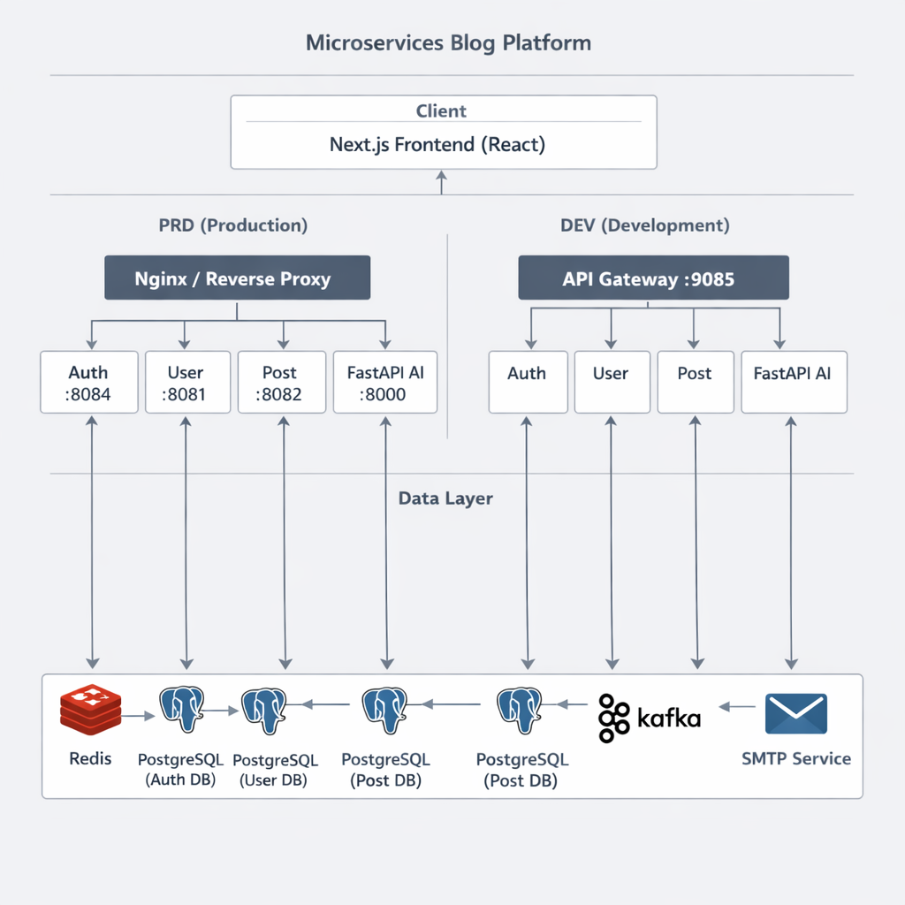
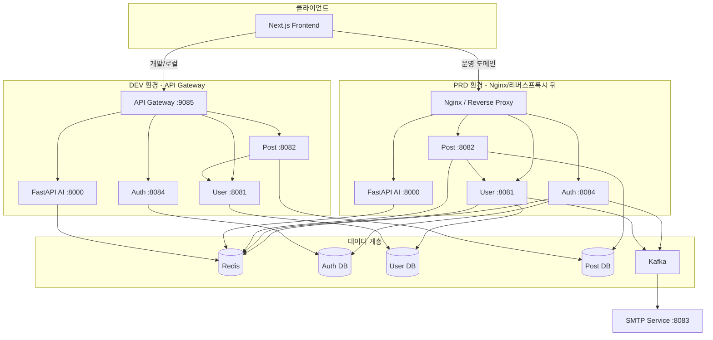
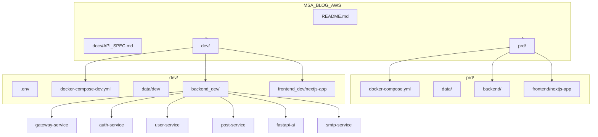

# MSA Blog AWS

블로그 서비스를 위한 **마이크로서비스 아키텍처(MSA)** 프로젝트입니다.  
인증·사용자·게시글·댓글·AI 챗봇·메일 발송 등 기능별로 서비스를 분리하고, **PRD(운영)** / **DEV(개발)** 환경을 구분하여 구성합니다.

---

## 목차

- [시연 (Demo)](#시연-demo)
- [전체 아키텍처](#전체-아키텍처)
- [아키텍처 구조도](#아키텍처-구조도)
- [파일 구조](#파일-구조)
- [실행 방법](#실행-방법)
- [API 명세서](#api-명세서)
- [기술 스택](#기술-스택)

---

## 시연 (Demo)

블로그 앱 실행 시 **랜딩 페이지**에서 로그인, **모든 포스트 보기** 등 주요 화면을 확인할 수 있습니다.

| 설명 |
|------|
| 상단: 햄버거 메뉴(사이드바), **MinkowskiM** 로고, 테마 전환, **로그인** 버튼 |
| 중앙: 블로그 제목·태그라인, **모든 포스트 보기 →** 버튼(게시글 목록 진입) |
| 하단: Posts 영역, 보조 버튼(맨 위로 이동 등) |


*실행 방법은 아래 [실행 방법](#실행-방법)을 참고하세요.*

---

## 전체 아키텍처

### 개요

- **클라이언트**: Next.js 기반 SPA (React)
- **백엔드**: Spring Boot 기반 마이크로서비스 + FastAPI(AI 챗봇)
- **인프라**: Docker Compose로 DB·캐시·메시지 큐·각 서비스 컨테이너 오케스트레이션

### 환경별 차이

| 구분 | PRD (운영) | DEV (개발) |
|------|------------|------------|
| **진입점** | Nginx 등 리버스 프록시 → 각 서비스 포트 직접 노출 | **API Gateway** 하나(9085)로 통합 라우팅 |
| **Gateway** | 없음 | Spring Cloud Gateway (8085 → 9085 노출) |
| **Frontend** | 3000 포트, 운영 도메인 연동 | 4000 포트, 개발 도메인/로컬 연동 |
| **데이터** | `prd/data/` 볼륨 | `dev/data/dev/` 볼륨 (운영과 분리) |

### 서비스 구성

| 서비스 | 역할 | PRD 포트 | DEV (Gateway 내부) |
|--------|------|----------|---------------------|
| **Auth Service** | 이메일 인증, 로그인/회원가입, JWT 발급 | 8084 | 8084 |
| **User Service** | 사용자 정보, 닉네임/아이디 중복 체크 | 8081 | 8081 |
| **Post Service** | 게시글·댓글·카테고리·태그 CRUD | 8082 | 8082 |
| **FastAPI AI** | LLM 챗봇 (Groq), 세션/기억 저장 | 8000 | 8000 |
| **SMTP Service** | Kafka 구독 → 메일 발송 | 8083 | 8083 |
| **API Gateway** | 라우팅, CORS, 인증 헤더/쿠키 전달 | - | **9085** (유일 진입점) |

### 공통 인프라 (PRD/DEV 공통)

- **Redis**: 세션/캐시 (PRD: 6379, DEV: 7379)
- **PostgreSQL**: 서비스별 DB 분리 (auth, user, post)
- **Kafka + Zookeeper**: 이벤트 드리븐 (회원가입 → User 생성, 메일 발송 등)
- **Kafka UI**: 토픽/메시지 확인 (PRD: 8080, DEV: 9080)

---

## 아키텍처 구조도

아키텍처를 **그림**으로 한눈에 보기:



*클라이언트 → PRD( Nginx / 각 서비스) 또는 DEV( API Gateway ) → Auth / User / Post / AI → 데이터 계층( Redis, PostgreSQL, Kafka, SMTP )*

---

아래는 동일 구조를 **Mermaid**로 표현한 것입니다. (GitHub·GitLab 등에서는 코드 블록이 다이어그램으로 렌더링됩니다.)



### 요청 흐름 (DEV 기준)

1. 브라우저 → `https://dev.minkowskim.com` (또는 `http://localhost:9085`) → **API Gateway(9085)**
2. Gateway가 Path에 따라 라우팅:
   - `/auth/**` → Auth Service (8084)
   - `/user/**` → User Service (8081)
   - `/api/posts/**` → Post Service (8082)
   - `/chat/**` → FastAPI AI (8000)
3. 각 서비스는 DB·Redis·Kafka 등과 통신 후 응답을 Gateway를 통해 클라이언트에 반환.

---

## 파일 구조

```
MSA_BLOG_AWS/
├── README.md                 # 본 문서
├── docs/
│   └── API_SPEC.md           # API 명세서 (PRD/DEV 공통)
├── msa_project_key.pem       # AWS 등 서버 접속 키 (선택)
│
├── prd/                      # 운영(Production) 환경
│   ├── docker-compose.yml     # PRD 전체 스택 정의
│   ├── data/                 # 볼륨 마운트 (auth_db, user_db, post_db, chatbot)
│   ├── backend/
│   │   ├── auth-service/     # Spring Boot - 인증
│   │   ├── user-service/     # Spring Boot - 사용자
│   │   ├── post-service/     # Spring Boot - 게시글/댓글
│   │   ├── fastapi-ai/        # FastAPI - 챗봇
│   │   └── smtp-service/      # Spring Boot - 메일 발송
│   └── frontend/
│       └── nextjs-app/       # Next.js 앱 (운영 빌드)
│
└── dev/                      # 개발(Development) 환경
    ├── .env.example          # 환경 변수 예시
    ├── .env                  # 실제 값 (git 제외 권장)
    ├── docker-compose-dev.yml
    ├── data/dev/             # 개발 전용 DB/챗봇 데이터
    ├── backend_dev/
    │   ├── gateway-service/  # Spring Cloud Gateway (DEV 전용)
    │   ├── auth-service/
    │   ├── user-service/
    │   ├── post-service/
    │   ├── fastapi-ai/
    │   └── smtp-service/
    └── frontend_dev/
        └── nextjs-app/       # Next.js 앱 (개발용)
```

### 파일 구조도 (다이어그램)



### 백엔드 서비스 공통 구조 (Spring Boot 예시)

```
backend(_dev)/{service-name}/
├── Dockerfile
├── pom.xml (또는 build 설정)
├── mvnw, mvnw.cmd
└── src/main/
    ├── java/com/mk/{module}/
    │   ├── controller/   # REST API
    │   ├── service/
    │   ├── repository/
    │   ├── entity/
    │   ├── dto/
    │   ├── security/     # JWT, CORS 등
    │   └── kafka/        # (해당 시)
    └── resources/
        ├── application.yml
        └── application.properties (선택)
```

---

## 실행 방법

아래 순서대로 진행하면 **실행 방법을 모르는 사람도** 동일하게 실행할 수 있습니다.

### 사전 요구 사항

- **Docker** 및 **Docker Compose** 설치
- (선택) **Node.js 18+** · **npm** — 프론트만 로컬에서 실행할 경우
- (선택) **Java 17+** · **Maven** — 백엔드만 로컬에서 실행할 경우

---

### 1) DEV 환경으로 전체 실행 (권장: 처음 실행 시)

DEV는 **API Gateway**로 한 포트(9085)에 묶여 있어 설정이 단순합니다.

1. **프로젝트 루트로 이동**
   ```bash
   cd E:\MSA_BLOG_AWS\dev
   ```

2. **환경 변수 설정**
   - `dev/.env.example`을 복사해 `dev/.env` 생성
   - 필요한 값만 수정 (JWT_SECRET, GROQ_API_KEY, 메일 설정 등)
   ```bash
   copy .env.example .env
   ```

3. **Docker Compose로 전체 기동**
   ```bash
   docker compose -f docker-compose-dev.yml up -d --build
   ```
   - 최초 실행 시 이미지 빌드로 수 분 소요될 수 있습니다.

4. **동작 확인**
   - **프론트엔드**: http://localhost:4000  
   - **API Gateway(백엔드 진입점)**: http://localhost:9085  
   - **Kafka UI**: http://localhost:9080  

5. **프론트에서 백엔드 주소 지정 (로컬 테스트)**  
   프론트가 `localhost:9085`를 보려면, `dev/frontend_dev/nextjs-app`에 `.env.local` 생성:
   ```env
   NEXT_PUBLIC_AUTH_API_URL=http://localhost:9085
   NEXT_PUBLIC_API_URL=http://localhost:9085
   NEXT_PUBLIC_POST_API_URL=http://localhost:9085
   NEXT_PUBLIC_CHATBOT_API_URL=http://localhost:9085/chat
   ```
   이후 프론트만 다시 빌드/실행하려면:
   ```bash
   cd frontend_dev/nextjs-app
   npm install
   npm run dev
   ```
   (Docker로 띄운 경우에는 이미 빌드 시 위 URL이 들어가 있으므로, 로컬에서만 쓸 때 위 설정 사용)

6. **중지**
   ```bash
   docker compose -f docker-compose-dev.yml down
   ```

---

### 2) PRD 환경으로 전체 실행

PRD는 **Gateway 없이** 각 서비스 포트가 직접 열립니다. (실제 운영에서는 Nginx 등이 이 포트들로 프록시합니다.)

1. **프로젝트 루트로 이동**
   ```bash
   cd E:\MSA_BLOG_AWS\prd
   ```

2. **Docker Compose로 전체 기동**
   ```bash
   docker compose up -d --build
   ```

3. **접속 주소**
   - **프론트엔드**: http://localhost:3000  
   - **Auth**: http://localhost:8084  
   - **User**: http://localhost:8081  
   - **Post**: http://localhost:8082  
   - **챗봇**: http://localhost:8000  
   - **Kafka UI**: http://localhost:8080  

4. **프론트가 로컬 백엔드를 쓰는 경우**  
   `prd/frontend/nextjs-app/.env.local`에 예:
   ```env
   NEXT_PUBLIC_API_URL=http://localhost:8081
   NEXT_PUBLIC_AUTH_API_URL=http://localhost:8084
   NEXT_PUBLIC_POST_API_URL=http://localhost:8082
   NEXT_PUBLIC_CHATBOT_API_URL=http://localhost:8000/chat
   ```

5. **중지**
   ```bash
   docker compose down
   ```

---

### 3) 프론트엔드만 로컬에서 실행 (백엔드는 Docker)

- **DEV**  
  - 백엔드: `dev`에서 `docker-compose-dev.yml`로 기동 (Gateway 9085)  
  - 프론트: `dev/frontend_dev/nextjs-app`에서 `.env.local`에 `http://localhost:9085` 설정 후  
    ```bash
    npm install && npm run dev
    ```
- **PRD**  
  - 백엔드: `prd`에서 `docker-compose up -d`  
  - 프론트: `prd/frontend/nextjs-app`에서 `.env.local`에 위 PRD 포트대로 설정 후  
    ```bash
    npm install && npm run dev
    ```

---

### 4) 트러블슈팅

| 현상 | 확인 사항 |
|------|-----------|
| 포트 충돌 | 다른 프로그램이 3000, 4000, 6379, 8080~9085, 9092 등 사용 중인지 확인 |
| CORS / 403 | Gateway·각 서비스의 CORS·Cookie 도메인 설정이 프론트 호스트와 일치하는지 확인 |
| DB 초기화 | `prd/data/`, `dev/data/dev/` 폴더 삭제 후 Compose 다시 up (데이터 전부 삭제됨) |
| 빌드 실패 | `docker compose ... --build` 재실행, 또는 해당 서비스 디렉터리에서 로컬 빌드 후 Dockerfile 재검토 |

---

## API 명세서

PRD/DEV 공통 API 명세는 ** [docs/API_SPEC.md](docs/API_SPEC.md) ** 에 정리되어 있습니다.

- **Auth**: 인증번호 발송/검증, 회원가입, 로그인, 로그아웃  
- **User**: 내 정보, 아이디/닉네임 중복 체크, 닉네임 목록  
- **Post**: 게시글 CRUD, 목록/카테고리/태그별 조회, 카테고리·태그 목록  
- **Comment**: 댓글 CRUD  
- **Chat**: AI 챗봇 메시지, 세션 초기화  

환경별 **Base URL**만 다음처럼 다릅니다.

- **DEV**: `http://localhost:9085` (또는 `https://dev.minkowskim.com`) — Gateway 한 주소
- **PRD**: 서비스별 `http://localhost:8084`, `8081`, `8082`, `8000` 등

---

## 기술 스택

| 영역 | 기술 |
|------|------|
| Frontend | Next.js 14, React 18, Axios |
| Backend | Spring Boot 3 (Java 17), FastAPI (Python) |
| Gateway | Spring Cloud Gateway (DEV) |
| DB | PostgreSQL 15 |
| Cache | Redis (Alpine) |
| Message Queue | Apache Kafka, Zookeeper |
| AI | LangChain + Groq (LLM) |
| Mail | SMTP (Kafka Consumer) |
| 인증 | JWT (HttpOnly Cookie) |
| 인프라 | Docker, Docker Compose |

---

실제 운영 시에는 **Nginx**(또는 ALB 등)에서 도메인별로 위 서비스/포트로 `proxy_pass` 하면 됩니다. (Nginx 설정 예는 프로젝트 내 별도 문서 또는 인프라 레포에서 관리하는 것을 권장합니다.)
