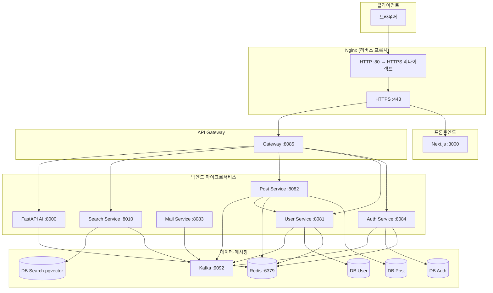
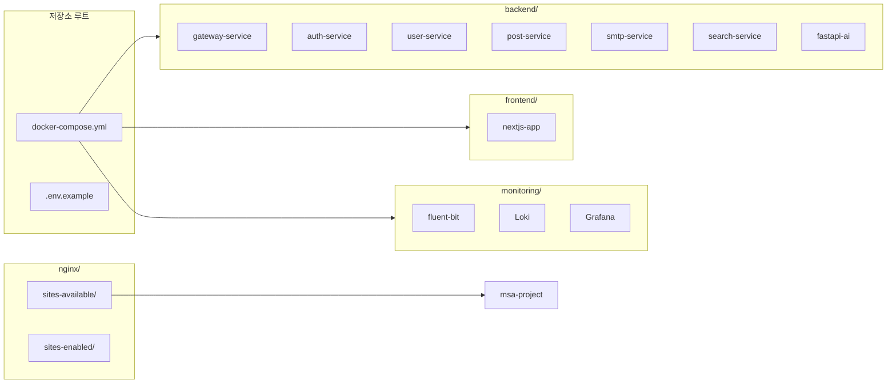
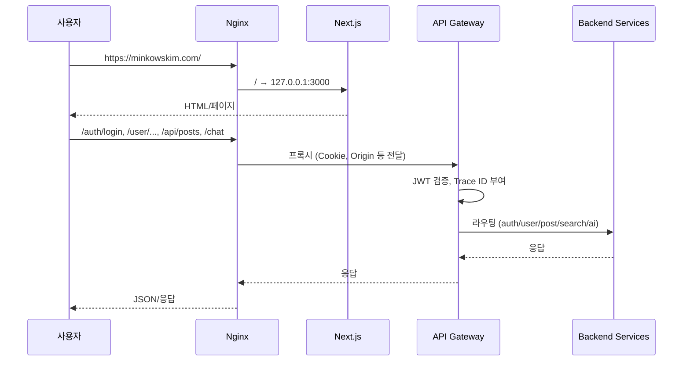
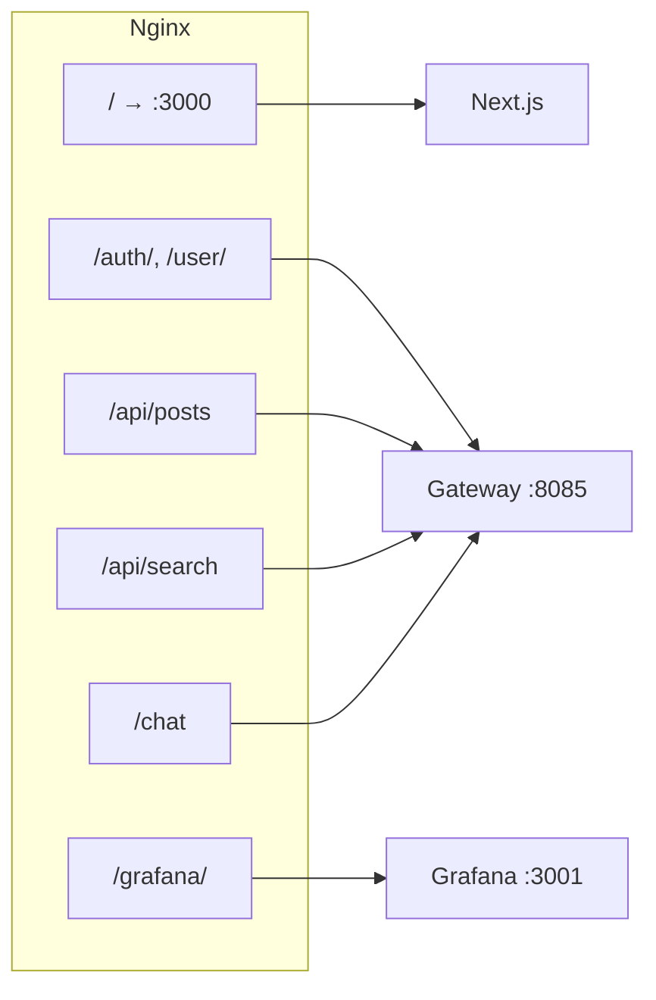

# MinKowskiM — MSA 블로그 플랫폼

백엔드·프론트엔드·AI를 아우르는 **마이크로서비스 블로그** 프로젝트입니다.  
API Gateway, Auth/User/Post/Search/Mail/AI 서비스, Next.js 프론트엔드, Redis·Kafka·PostgreSQL로 구성됩니다.

---

## 목차

- [시스템 아키텍처](#시스템-아키텍처)
- [프로젝트 구조](#프로젝트-구조)
- [요청 흐름](#요청-흐름)
- [Nginx 라우팅](#nginx-라우팅)
- [API 명세](#api-명세)
- [빠른 시작](#빠른-시작)
- [서비스 구성](#서비스-구성)
- [백오피스·모니터링](#백오피스모니터링-활용-가이드)
- [환경 변수](#환경-변수)
- [참고 문서](#참고-문서)

---

## 시스템 아키텍처


```mermaid
flowchart TB
    subgraph Client["클라이언트"]
        Browser[브라우저]
    end

    subgraph Nginx["Nginx (리버스 프록시)"]
        N80[HTTP :80 → HTTPS 리다이렉트]
        N443[HTTPS :443]
    end

    subgraph Frontend["프론트엔드"]
        Next[Next.js :3000]
    end

    subgraph Gateway["API Gateway"]
        GW[Gateway :8085]
    end

    subgraph Backend["백엔드 마이크로서비스"]
        Auth[Auth Service :8084]
        User[User Service :8081]
        Post[Post Service :8082]
        Mail[Mail Service :8083]
        Search[Search Service :8010]
        AI[FastAPI AI :8000]
    end

    subgraph Data["데이터·메시징"]
        Redis[(Redis :6379)]
        Kafka[Kafka :9092]
        DBA[(DB Auth)]
        DBU[(DB User)]
        DBP[(DB Post)]
        DBS[(DB Search pgvector)]
    end

    Browser --> N80
    N80 --> N443
    N443 --> Next
    N443 --> GW

    GW --> Auth
    GW --> User
    GW --> Post
    GW --> Search
    GW --> AI

    Auth --> Redis
    Auth --> DBA
    Auth --> Kafka
    User --> Redis
    User --> DBU
    User --> Kafka
    Post --> DBP
    Post --> Redis
    Post --> User
    Post --> Kafka
    Mail --> Kafka
    Search --> Kafka
    Search --> DBS
    AI --> Redis
```

---

## 프로젝트 구조


```mermaid
flowchart LR
    subgraph Repo["저장소 루트"]
        DC[docker-compose.yml]
        ENV[.env.example]
    end

    subgraph Backend["backend/"]
        GW[gateway-service]
        AUTH[auth-service]
        USER[user-service]
        POST[post-service]
        SMTP[smtp-service]
        SEARCH[search-service]
        AI[fastapi-ai]
    end

    subgraph Frontend["frontend/"]
        NEXT[nextjs-app]
    end

    subgraph Nginx["nginx/"]
        SA[sites-available/]
        SE[sites-enabled/]
    end

    subgraph Monitor["monitoring/"]
        FB[fluent-bit]
        Loki[Loki]
        Grafana[Grafana]
    end

    DC --> Backend
    DC --> Frontend
    DC --> Monitor
    SA --> msa-project
```

### 디렉터리 트리

```
my-msa-project/
├── backend/
│   ├── gateway-service/   # API Gateway (JWT·Trace ID·라우팅)
│   ├── auth-service/     # 인증 (로그인·회원가입·OAuth2)
│   ├── user-service/     # 사용자 정보
│   ├── post-service/     # 게시글·댓글·카테고리·태그
│   ├── smtp-service/     # 메일 발송 (Kafka 소비)
│   ├── search-service/   # 검색 (FastAPI + pgvector)
│   └── fastapi-ai/       # 챗봇 (FastAPI)
├── frontend/
│   └── nextjs-app/       # Next.js 블로그 UI
├── nginx/
│   ├── sites-available/  # Nginx 사이트 설정 (msa-project 등)
│   └── sites-enabled/    # 활성화된 사이트 심볼릭 링크
├── monitoring/           # Loki·Fluent Bit·Grafana 설정
├── docker-compose.yml
├── .env.example
└── README.md
```

---

## 요청 흐름


```mermaid
sequenceDiagram
    participant U as 사용자
    participant N as Nginx
    participant F as Next.js
    participant G as API Gateway
    participant S as Backend Services

    U->>N: https://minkowskim.com/
    N->>F: / → 127.0.0.1:3000
    F-->>U: HTML/페이지

    U->>N: /auth/login, /user/..., /api/posts, /chat
    N->>G: 프록시 (Cookie, Origin 등 전달)
    G->>G: JWT 검증, Trace ID 부여
    G->>S: 라우팅 (auth/user/post/search/ai)
    S-->>G: 응답
    G-->>N: 응답
    N-->>U: JSON/응답
```

---

## Nginx 라우팅

운영 환경에서는 **Nginx**가 단일 진입점이며, `nginx/sites-available/` 설정을 사용합니다.

| 경로 | 프록시 대상 | 비고 |
|------|-------------|------|
| `/` | `127.0.0.1:3000` | Next.js 프론트엔드 |
| `/user/` | Gateway `127.0.0.1:8085` | 사용자 API |
| `/auth/` | Gateway `127.0.0.1:8085` | 인증 API |
| `/api/posts` | Gateway | 게시글 API |
| `/api/search` | Gateway | 검색 API |
| `/chat` | Gateway | AI 챗봇 (타임아웃 600s) |
| `/actuator` | Gateway | 헬스체크·백오피스 |
| `/grafana/` | `127.0.0.1:3001` | Grafana (monitoring 프로파일) |

- **운영 도메인**: `minkowskim.com`, `www.minkowskim.com` (HTTP → HTTPS 301 리다이렉트)
- **개발 도메인**: `dev.minkowskim.com` (프론트 4000, Gateway 9085)
- 설정 파일: `nginx/sites-available/msa-project`  
  활성화: `sites-enabled`에 해당 설정 심볼릭 링크 생성 후 `nginx -s reload`


```mermaid
flowchart LR
    subgraph Nginx["Nginx"]
        L["/ → :3000"]
        A["/auth/, /user/"]
        P["/api/posts"]
        S["/api/search"]
        C["/chat"]
        G["/grafana/"]
    end

    L --> Next[Next.js]
    A --> GW[Gateway :8085]
    P --> GW
    S --> GW
    C --> GW
    G --> Grafana[Grafana :3001]
```

---

## API 명세

> 모든 API는 **Nginx → API Gateway(8085)** 를 거쳐 호출됩니다.  
> Base URL 예: `https://minkowskim.com` (운영), `http://localhost:8085` (로컬 직접 호출)  
> **인증 필요** API는 `Cookie: authToken=<JWT>` 또는 `Authorization: Bearer <JWT>` 필요.

---

### 인증 (Auth) — `/auth`

| Method | Path | 설명 | 인증 | Request Body | Response |
|--------|------|------|------|--------------|----------|
| POST | `/auth/send-code` | 이메일 인증번호 발송 | X | `{ "email": "string" }` | 200 / 503 |
| POST | `/auth/verify-code` | 인증번호 확인 | X | `{ "email", "code" }` | 200 / 400 |
| POST | `/auth/find-username/send` | 아이디 찾기: 이메일로 인증번호 발송 | X | `{ "email" }` | 200 / 400 |
| POST | `/auth/find-username/verify` | 아이디 찾기: 인증 후 아이디 반환 | X | `{ "email", "code" }` | 200 `{ "username" }` / 400 |
| POST | `/auth/reset-password/send` | 비밀번호 찾기: 인증번호 발송 | X | `{ "email" }` | 200 / 400 |
| POST | `/auth/reset-password/verify` | 비밀번호 재설정 | X | `{ "email", "code", "newPassword" }` | 200 / 400 |
| POST | `/auth/signup` | 회원가입 | X | `{ "username", "password", "nickname", "email" }` | 200 `{ "id", "username", "token" }` |
| POST | `/auth/login` | 로그인 (쿠키에 authToken, refreshToken 설정) | X | `{ "username", "password" }` | 200 `{ "id", "username", "token" }` |
| POST | `/auth/logout` | 로그아웃 (쿠키·Redis 리프레시 토큰 삭제) | O | - | 200 |
| POST | `/auth/refresh` | 리프레시 토큰으로 액세스 토큰 재발급 | 쿠키/X-Refresh-Token | - | 200 `{ "id", "username", "token" }` / 401 |
| POST | `/auth/extend` | 현재 액세스 토큰으로 세션 연장 | O | - | 200 `{ "id", "username", "token" }` / 401 |

---

### 사용자 (User) — `/user`

| Method | Path | 설명 | 인증 | Query / Body | Response |
|--------|------|------|------|--------------|----------|
| GET | `/user/check-username` | 아이디 중복 확인 | X | `?username=string` | 200 `boolean` |
| GET | `/user/me` | 현재 로그인 유저 정보 | O | - | 200 `UserResponse` |
| GET | `/user/check-nickname` | 닉네임 중복 확인 | X | `?nickname=string` | 200 `boolean` |
| POST | `/user/api/users/nicknames` | 여러 사용자 ID로 닉네임 목록 조회 | O | `["userId1", "userId2", ...]` | 200 `{ "userId": "nickname", ... }` |

---

### 게시글 (Post) — `/api/posts`

| Method | Path | 설명 | 인증 | Query / Body | Response |
|--------|------|------|------|--------------|----------|
| GET | `/api/posts` | 게시글 목록 (페이징) | X | `?page=0&size=10` | 200 `Page<PostResponse>` |
| GET | `/api/posts/{id}` | 게시글 단건 조회 | X | - | 200 `PostResponse` |
| GET | `/api/posts/popular` | 인기 게시글 목록 | X | `?limit=3` (기본 3, 최대 10) | 200 `List<PostResponse>` |
| GET | `/api/posts/search` | 키워드(SQL LIKE) 검색 | X | `?q=string&limit=20` | 200 `{ "query", "results" }` |
| GET | `/api/posts/category` | 카테고리별 목록 | X | `?name=string&page=0&size=10` | 200 `Page<PostResponse>` |
| GET | `/api/posts/tag` | 태그별 목록 | X | `?name=string&page=0&size=10` | 200 `Page<PostResponse>` |
| GET | `/api/posts/categories` | 카테고리 목록(개수 포함) | X | - | 200 `List<CategoryResponse>` |
| GET | `/api/posts/tags` | 태그 목록(개수 포함) | X | - | 200 `List<TagResponse>` |
| POST | `/api/posts` | 게시글 작성 | O | `PostRequest` (title, content, categoryId, tagIds 등) | 200 `PostResponse` |
| PUT | `/api/posts/{id}` | 게시글 수정 | O | `PostRequest` | 200 `PostResponse` |
| DELETE | `/api/posts/{id}` | 게시글 삭제 | O | - | 200 |

---

### 댓글 (Comment) — `/api/posts`

| Method | Path | 설명 | 인증 | Body | Response |
|--------|------|------|------|------|----------|
| GET | `/api/posts/{postId}/comments` | 댓글 목록 | X | - | 200 `List<CommentResponse>` |
| POST | `/api/posts/{postId}/comments` | 댓글 작성 | O | `CommentRequest` (content 등) | 200 `CommentResponse` |
| PUT | `/api/posts/comments/{commentId}` | 댓글 수정 | O | `CommentRequest` | 200 `CommentResponse` |
| DELETE | `/api/posts/comments/{commentId}` | 댓글 삭제 | O | - | 200 |

---

### 검색 (Search) — `/api/search`

| Method | Path | 설명 | 인증 | Query / Body | Response |
|--------|------|------|------|--------------|----------|
| GET | `/api/search` | 의미 기반 검색 (pgvector 임베딩) | X | `?q=string&limit=10` (1~50) | 200 `{ "query", "results": [{ "postId", "title", "snippet", "score" }] }` |
| GET | `/api/search/related` | 연관 포스트 (특정 글과 유사한 글) | X | `?post_id=int&limit=5` (1~20) | 200 `{ "postId", "results" }` |
| POST | `/api/search/index` | 검색 인덱스 동기 반영 (내부/배치용) | - | `{ "postId" 또는 "post_id", "title", "content" }` | 200 `{ "ok", "postId" }` / 400 |
| DELETE | `/api/search/index/{post_id}` | 검색 인덱스에서 삭제 | - | - | 200 `{ "ok", "postId" }` |
| GET | `/health` | 검색 서비스 헬스 | X | - | 200 `{ "status": "UP" }` |

---

### AI 챗봇 (Chat) — `/chat`

| Method | Path | 설명 | 인증 | Body | Response |
|--------|------|------|------|------|----------|
| GET | `/chat/health` | 챗봇 헬스 (LLM 설정 여부 포함) | X | - | 200 `{ "status", "llm_configured" }` |
| POST | `/chat` | 채팅 메시지 전송 | X | `{ "session_id": "string", "message": "string" }` | 200 `{ "response": "string" }` |
| POST | `/chat/clear` | 대화 기록 초기화 | X | `{ "session_id": "string" }` | 200 `{ "message": "기록이 초기화되었습니다." }` |

---

### 모니터링·헬스

| Method | Path | 설명 | 인증 |
|--------|------|------|------|
| GET | `/actuator/health` | Gateway 헬스 체크 (백오피스에서 사용) | X |

---

## 빠른 시작

### 1. 환경 설정

```bash
cp .env.example .env
# .env 에 DB 비밀번호, JWT_SECRET, OAuth2, SMTP, GROQ_API_KEY 등 채우기
```

### 2. 전체 서비스 기동

```bash
docker compose up -d
```

- **프론트엔드**: http://localhost:3000 (또는 배포 도메인)
- **API Gateway**: http://localhost:8085

### 3. Nginx와 연동 (운영)

1. `nginx/sites-available/msa-project` 내용을 서버의 `/etc/nginx/sites-available/` 에 반영
2. `ln -s /etc/nginx/sites-available/msa-project /etc/nginx/sites-enabled/`
3. SSL 인증서 경로·도메인 확인 후 `nginx -t` → `nginx -s reload`

### 4. 선택 기동 (프로파일)

| 목적           | 명령어                                      |
|----------------|---------------------------------------------|
| 모니터링 스택  | `docker compose --profile monitoring up -d` |
| Kafka UI       | `docker compose --profile tools up -d`      |

---

## 서비스 구성

| 서비스         | 포트  | 역할                          |
|----------------|-------|-------------------------------|
| api-gateway    | 8085  | 단일 진입점, JWT 검증, 라우팅 |
| auth-service   | 8084  | 로그인·회원가입·OAuth2       |
| user-service   | 8081  | 사용자 정보                   |
| post-service   | 8082  | 게시글·댓글·카테고리·태그    |
| mail-service   | 8083  | SMTP 메일 (Kafka 소비)       |
| search-service | 8010  | 검색 (pgvector)               |
| fastapi-ai     | 8000  | 챗봇                         |
| frontend       | 3000  | Next.js                      |
| redis          | 6379  | 캐시·세션·조회수              |
| msa-kafka      | 9092  | 이벤트·메일 큐               |
| db-auth/user/post/search | 5432–5435 | PostgreSQL |

---

## 백오피스·모니터링 활용 가이드

### 백오피스 (서비스 헬스 체크)

- **로컬**: http://localhost:3000/backoffice  
- **운영**: https://minkowskim.com/backoffice  

시스템 동작 상태 테이블에서 Gateway / Post / Search / Chat 서비스 **정상(UP)** 여부를 확인합니다.

### Grafana + Loki (로그·대시보드)

```bash
docker compose --profile monitoring up -d
```

- **로컬**: http://localhost:3001  
- **운영**: https://minkowskim.com/grafana  

Explore → Loki에서 `{container_name="msa-gateway"}` 등으로 로그 검색.

### 정리

| 화면       | 용도                         |
|------------|------------------------------|
| 백오피스   | 서비스별 UP/DOWN 헬스 체크   |
| Grafana    | 대시보드·Loki 로그 조회      |
| Kafka UI   | 토픽·메시지 확인 (tools 프로파일) |

---

## 환경 변수

`.env.example`을 복사해 `.env`를 만든 뒤 아래 항목을 채웁니다.

- **DB**: `POSTGRES_USER`, `POSTGRES_PASSWORD`, 각 DB 이름
- **JWT**: `JWT_SECRET`
- **OAuth2**: Google/Kakao 클라이언트 ID·Secret, `COOKIE_DOMAIN`, `FRONTEND_URL`
- **Redis**: `SPRING_REDIS_HOST`, `REDIS_HOST`, `REDIS_PORT`
- **Kafka**: `SPRING_KAFKA_BOOTSTRAP_SERVERS`
- **SMTP**: `MAIL_USERNAME`, `MAIL_PASSWORD`
- **AI**: `GROQ_API_KEY`
- **프론트**: `NEXT_PUBLIC_API_URL`, `NEXT_PUBLIC_POST_API_URL`, `NEXT_PUBLIC_CHATBOT_API_URL`
- **모니터링(선택)**: `GRAFANA_ADMIN_PASSWORD`

---

## 참고 문서

- `docs/nginx_부터_시스템_실행_최종_점검.md` — Nginx·쿠키·라우팅 점검
- `docs/Nginx_운영_라우팅_설명.md` — Nginx 라우팅 상세
- `docs/DEPLOY_LIGHTSAIL.md` — AWS Lightsail 배포

---

이 README와 **백오피스·모니터링** 섹션만 따라가도, 서비스 상태 확인과 로그 조회 흐름을 잡을 수 있습니다.
