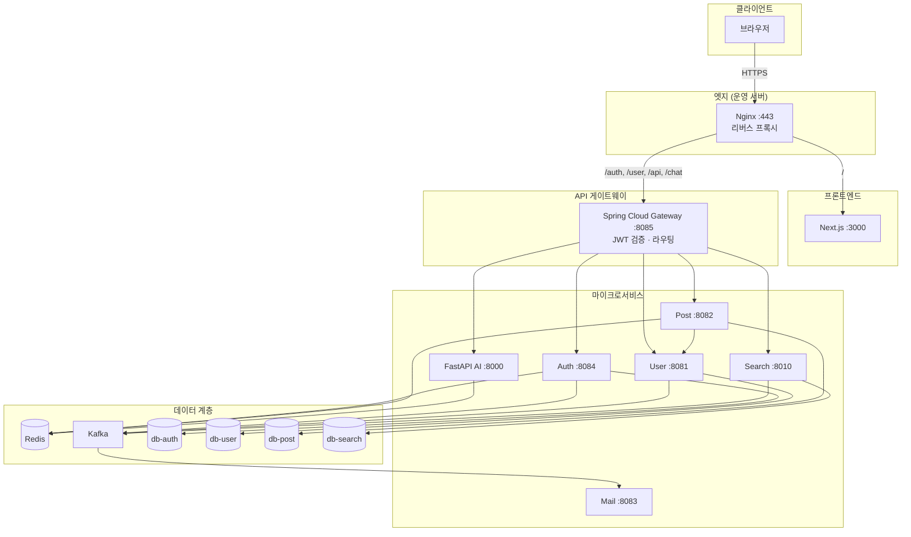

# MSA 블로그 플랫폼 (e-check)

> **운영 서버**  
> 🌐 **https://minkowskim.com**  
> 개발 서버는 필요 시에만 기동합니다. (동일 Lightsail 4GB 인스턴스 사용 — 동시 기동 시 메모리 부족으로 서버 다운 방지를 위함)

---

이 문서는 **처음 보는 사람도 바로 이해할 수 있도록** 전체 시스템 구조, 요청 흐름, API, Nginx 라우팅, 서비스 구성, 환경 변수까지 한곳에 정리한 프로젝트 개요입니다.  
**Spring Cloud Gateway 기반 MSA**, **Next.js 프론트엔드**, **FastAPI(AI·검색)**, **Kafka·Redis·PostgreSQL**을 단일 Docker Compose로 4GB 메모리 제약 안에서 운영할 수 있도록 설계·구성한 역량을 담았습니다.

---

## 목차

- [시스템 아키텍처](#시스템-아키텍처)
- [프로젝트 구조](#프로젝트-구조)
- [요청 흐름](#요청-흐름)
- [Nginx 라우팅](#nginx-라우팅)
- [API 명세](#api-명세)
- [빠른 시작](#빠른-시작)
- [서비스 구성](#서비스-구성)
- [백오피스·모니터링](#백오피스모니터링)
- [환경 변수](#환경-변수)
- [참고 문서](#참고-문서)

---

## 시스템 아키텍처

클라이언트는 **HTTPS(443)** 로만 접근하며, Nginx가 리버스 프록시로 **프론트엔드(Next.js)** 와 **API Gateway(8085)** 로 요청을 나눕니다. 모든 백엔드 API는 **Gateway 한 곳**을 거쳐 각 마이크로서비스로 라우팅됩니다.

```
                                    ┌─────────────────────────────────────────────────────────┐
                                    │                    HTTPS (443)                          │
                                    │              minkowskim.com / dev.minkowskim.com         │
                                    └─────────────────────────┬───────────────────────────────┘
                                                              │
                                                              ▼
                                    ┌─────────────────────────────────────────────────────────┐
                                    │                     Nginx (리버스 프록시)                 │
                                    │  / → Next.js │ /auth, /user, /api, /chat → Gateway      │
                                    └───┬─────────────────────────────────────┬───────────────┘
                                        │                                     │
              ┌─────────────────────────▼─────────────┐     ┌─────────────────▼─────────────────────┐
              │     Next.js (Frontend) :3000 / :4000   │     │   Spring Cloud Gateway :8085 / :9085  │
              │     App Router, API 클라이언트          │     │   JWT 검증 · 라우팅 · Trace ID        │
              └───────────────────────────────────────┘     └─────────────────┬─────────────────────┘
                                                                               │
         ┌──────────────┬──────────────┬──────────────┬──────────────┬─────────┴─────────┐
         ▼              ▼              ▼              ▼              ▼                   ▼
   ┌──────────┐  ┌──────────┐  ┌──────────┐  ┌──────────┐  ┌──────────────┐       ┌──────────────┐
   │  Auth    │  │  User    │  │  Post    │  │  Search  │  │  FastAPI AI  │       │  Mail (SMTP) │
   │  :8084   │  │  :8081   │  │  :8082   │  │  :8010   │  │  :8000       │       │  :8083       │
   │  Spring  │  │  Spring  │  │  Spring  │  │  FastAPI │  │  FastAPI     │       │  Spring      │
   │  Boot    │  │  Boot    │  │  Boot    │  │ pgvector │  │  Groq/Redis  │       │  Kafka 구독  │
   └────┬─────┘  └────┬─────┘  └────┬─────┘  └────┬─────┘  └──────┬───────┘       └──────┬───────┘
        │             │             │             │               │                      │
        ▼             ▼             ▼             ▼               ▼                      ▼
   ┌──────────┐  ┌──────────┐  ┌──────────┐  ┌──────────┐  ┌──────────┐           ┌──────────────┐
   │ db-auth  │  │ db-user  │  │ db-post  │  │db-search  │  │  Redis   │           │    Kafka     │
   │PostgreSQL│  │PostgreSQL│  │PostgreSQL│  │ pgvector  │  │ 세션/캐시 │           │  (KRaft)     │
   └──────────┘  └──────────┘  └──────────┘  └──────────┘  └──────────┘           └──────────────┘
```

### 아키텍처 다이어그램 (Mermaid)


```mermaid
flowchart TB
    subgraph Client["클라이언트"]
        Browser[브라우저]
    end

    subgraph Edge["엣지 (운영 서버)"]
        Nginx[Nginx :443<br/>리버스 프록시]
    end

    subgraph Frontend["프론트엔드"]
        Next[Next.js :3000]
    end

    subgraph Gateway["API 게이트웨이"]
        GW[Spring Cloud Gateway :8085<br/>JWT 검증 · 라우팅]
    end

    subgraph Backend["마이크로서비스"]
        Auth[Auth :8084]
        User[User :8081]
        Post[Post :8082]
        Search[Search :8010]
        AI[FastAPI AI :8000]
        Mail[Mail :8083]
    end

    subgraph Data["데이터 계층"]
        Redis[(Redis)]
        Kafka[Kafka]
        DBA[(db-auth)]
        DBU[(db-user)]
        DBP[(db-post)]
        DBS[(db-search)]
    end

    Browser -->|HTTPS| Nginx
    Nginx -->|/| Next
    Nginx -->|/auth, /user, /api, /chat| GW
    GW --> Auth
    GW --> User
    GW --> Post
    GW --> Search
    GW --> AI
    Auth --> DBA
    Auth --> Redis
    Auth --> Kafka
    User --> DBU
    User --> Kafka
    Post --> DBP
    Post --> Redis
    Post --> User
    Search --> DBS
    Search --> Kafka
    AI --> Redis
    Kafka --> Mail
```

---

## 프로젝트 구조

```
e:\check\
├── docker-compose.yml          # 메인 MSA 스택 (4GB Lightsail 대상, mem_limit 설정)
├── .env                        # 환경 변수 (DB, JWT, API URL, 메일, OAuth 등)
├── data/                       # DB·챗봇 데이터 볼륨 (auth_db, user_db, post_db, search_db, chatbot)
│
├── nginx/                      # Nginx 설정 (리버스 프록시)
│   └── sites-available/
│       └── msa-project         # minkowskim.com, dev.minkowskim.com 라우팅
│
├── frontend/
│   └── nextjs-app/             # Next.js 14 (App Router), React 18
│       ├── src/app/
│       │   ├── backoffice/      # 관리자 백오피스
│       │   ├── robots.js, sitemap.js
│       └── src/services/api/   # API 클라이언트 (auth, posts, user, search, chat 등)
│
├── backend/
│   ├── gateway-service/        # Spring Cloud Gateway — 유일 API 진입점 (8085)
│   ├── auth-service/           # 인증·OAuth·이메일 인증 (8084)
│   ├── user-service/           # 유저 정보·닉네임 (8081)
│   ├── post-service/           # 게시글·댓글·카테고리·태그 (8082)
│   ├── smtp-service/           # Kafka 구독 → 메일 발송 (8083)
│   ├── fastapi-ai/             # 챗봇 (Groq, LangChain, Redis 세션) (8000)
│   └── search-service/         # FastAPI + pgvector 의미 검색 (8010)
│
├── monitoring/
│   ├── docker-compose.monitoring.yml
│   ├── fluent-bit/             # 로그 수집 → Loki
│   └── loki/                   # 로그 저장
│
└── my-msa-project-dev/         # 개발용 복제 (필요 시에만 기동)
    ├── backend_dev/            # user, post, auth, smtp, gateway 등
    └── frontend_dev/nextjs-app/
```

| 구분 | 기술 스택 |
|------|-----------|
| 프론트엔드 | Next.js 14 (App Router), React 18, axios |
| API 게이트웨이 | Spring Cloud Gateway, JWT 필터 |
| 백엔드 (인증·유저·포스트·메일) | Spring Boot, JPA, PostgreSQL |
| AI·검색 | FastAPI, LangChain/Groq, pgvector |
| 인프라 | Docker Compose, Redis, Kafka (KRaft), PostgreSQL×4 |

---

## 요청 흐름

1. **브라우저**  
   - `NEXT_PUBLIC_*_API_URL`(운영: `https://minkowskim.com`)으로 요청.  
   - 인증: 쿠키 `authToken`, `refreshToken` 또는 `Authorization: Bearer`.

2. **Nginx**  
   - `/` → Next.js (127.0.0.1:3000).  
   - `/auth/`, `/user/`, `/api/posts`, `/api/search`, `/chat`, `/actuator` → Gateway (127.0.0.1:8085).

3. **API Gateway (8085)**  
   - `JwtValidationGlobalFilter`: 공개 경로는 통과, 나머지는 JWT 검증 (쿠키/Bearer); 실패 시 401.  
   - 라우트: `/user` → msa-user:8081, `/auth` → msa-auth:8084, `/api/posts` → msa-post:8082, `/api/search` → msa-search:8010, `/chat` → msa-ai:8000.

4. **백엔드 서비스**  
   - Auth: Redis(리프레시 토큰), Kafka(이벤트), DB(auth). 메일 발송은 Kafka → smtp-service.  
   - User/Post: 각 DB + Redis/Kafka. Post는 User 서비스 HTTP 호출(닉네임 등).  
   - Search: Kafka 인덱스 이벤트, pgvector 임베딩 검색.  
   - FastAPI AI: Redis 세션, Groq LLM.

5. **데이터/이벤트**  
   - Kafka: 인증·유저·메일·검색 인덱스 이벤트.  
   - Redis: 리프레시 토큰, 캐시, 조회수 랭킹, 챗봇 세션.

---

## Nginx 라우팅

설정 파일: **`nginx/sites-available/msa-project`** (또는 `sites-enabled/msa-project`).

| 목적 | location | upstream |
|------|----------|----------|
| 프론트엔드 (운영) | `/` | `http://127.0.0.1:3000` |
| 유저 API | `/user/` | `http://msa-gateway` (127.0.0.1:8085) |
| 인증·OAuth | `/auth/` | `http://msa-gateway` |
| 게시글·댓글 | `/api/posts` | `http://msa-gateway` |
| 검색 | `/api/search` | `http://msa-gateway` |
| Actuator(헬스 등) | `/actuator` | `http://msa-gateway` |
| AI 챗봇 | `/chat` | `http://msa-gateway` (타임아웃 600s) |
| Grafana | `/grafana/` | `http://127.0.0.1:3001` (monitoring 프로파일 시) |

- **운영**: `minkowskim.com`, `www.minkowskim.com` → HTTP 301 HTTPS, SSL(Let’s Encrypt).  
- **개발**: `dev.minkowskim.com` → 프론트 `127.0.0.1:4000`, API `127.0.0.1:9085`.  
- **개발 서버**: 필요할 때만 기동. 동일 4GB Lightsail에서 운영+개발 동시 기동 시 메모리 부족으로 서버 다운이 발생할 수 있어, 운영 중일 때는 개발 스택을 올리지 않는 것을 권장합니다.

---

## API 명세

모든 클라이언트 요청은 **Gateway `:8085`** 로 들어가며, 아래 경로로 각 서비스에 프록시됩니다.

### Gateway (공개)

| Method | Path | 설명 |
|--------|------|------|
| GET | `/actuator/health` | 게이트웨이 헬스체크 |

### Auth Service (`/auth` → msa-auth:8084)

| Method | Path | 설명 |
|--------|------|------|
| POST | `/auth/send-code` | 이메일 인증번호 발송 |
| POST | `/auth/verify-code` | 인증번호 검증 |
| POST | `/auth/find-username/send` | 아이디 찾기 — 인증번호 발송 |
| POST | `/auth/find-username/verify` | 아이디 찾기 — 검증 후 아이디 반환 |
| POST | `/auth/reset-password/send` | 비밀번호 재설정 — 인증번호 발송 |
| POST | `/auth/reset-password/verify` | 비밀번호 재설정 — 검증 후 비밀번호 변경 |
| POST | `/auth/signup` | 회원가입 |
| POST | `/auth/login` | 로그인 (쿠키: authToken, refreshToken) |
| POST | `/auth/logout` | 로그아웃 |
| GET | `/auth/me` | 현재 로그인 사용자 (id, username, role) |
| POST | `/auth/refresh` | 리프레시 토큰으로 액세스 토큰 재발급 |
| POST | `/auth/extend` | 액세스 토큰으로 세션 연장 |

### User Service (`/user` → msa-user:8081)

| Method | Path | 설명 |
|--------|------|------|
| GET | `/user/check-username` | 아이디 중복 확인 (query: username) |
| GET | `/user/me` | 현재 로그인 유저 정보 |
| GET | `/user/check-nickname` | 닉네임 중복 확인 (query: nickname) |
| POST | `/user/api/users/nicknames` | userId 목록으로 닉네임 맵 (body: userIds) |

### Post Service (`/api/posts` → msa-post:8082)

| Method | Path | 설명 |
|--------|------|------|
| POST | `/api/posts` | 게시글 작성 (관리자) |
| PUT | `/api/posts/{id}` | 게시글 수정 |
| DELETE | `/api/posts/{id}` | 게시글 삭제 |
| GET | `/api/posts` | 게시글 목록 (페이지) |
| GET | `/api/posts/{id}` | 게시글 상세 |
| GET | `/api/posts/popular` | 조회수 기준 인기글 (query: limit) |
| GET | `/api/posts/search` | 키워드 검색 (query: q, limit) |
| GET | `/api/posts/category` | 카테고리별 목록 (query: name, page, size) |
| GET | `/api/posts/tag` | 태그별 목록 (query: name, page, size) |
| GET | `/api/posts/categories` | 카테고리 목록+개수 |
| GET | `/api/posts/tags` | 태그 목록+개수 |
| POST | `/api/posts/{postId}/comments` | 댓글 작성 |
| GET | `/api/posts/{postId}/comments` | 댓글 목록 |
| PUT | `/api/posts/comments/{commentId}` | 댓글 수정 |
| DELETE | `/api/posts/comments/{commentId}` | 댓글 삭제 |

### Search Service (`/api/search` → msa-search:8010)

| Method | Path | 설명 |
|--------|------|------|
| GET | `/api/search` | 의미 기반 검색 (query: q, limit) |
| GET | `/api/search/related` | 연관 포스트 (query: post_id, limit) |
| POST | `/api/search/index` | 검색 인덱스 동기 (body: postId, title, content) |
| DELETE | `/api/search/index/{post_id}` | 검색 인덱스에서 포스트 제거 |

### FastAPI AI — 챗봇 (`/chat` → msa-ai:8000)

| Method | Path | 설명 |
|--------|------|------|
| GET | `/chat/health`, `/health` | 헬스체크, LLM 설정 여부 |
| POST | `/chat` | 챗봇 대화 (body: session_id, message) |
| POST | `/clear`, `/chat/clear` | 세션 대화 기록 초기화 |

### 인증 정책 (Gateway)

- **공개(토큰 불필요)**: `/auth/login`, `/auth/signup`, `/auth/send-code`, `/auth/verify-code`, `/auth/refresh`, `/auth/extend`, GET `/api/posts`(목록/상세/카테고리/태그/댓글), `/api/posts/search`, `/api/search/**`, `/chat/**`, `/actuator/**`.  
- **그 외**: Cookie `authToken` 또는 `Authorization: Bearer` 검증; 실패 시 401.

---

## 빠른 시작

### 요구 사항

- Docker, Docker Compose  
- (선택) Nginx + SSL 인증서(운영)

### 1. 환경 변수

```bash
cp .env.example .env   # 있다면
# .env 에 DB 비밀번호, JWT_SECRET, MAIL_*, GROQ_API_KEY, NEXT_PUBLIC_*_API_URL 등 설정
```

### 2. 메인 스택 기동 (운영)

```bash
docker compose up -d
```

- 프론트: `http://localhost:3000`  
- API: `http://localhost:8085` (Nginx 쓰면 도메인 기준으로 위 Nginx 라우팅 적용)

### 3. 모니터링 스택 (선택)

```bash
docker compose --profile monitoring up -d
```

- Grafana: `https://minkowskim.com/grafana` (서브패스)

### 4. 개발 스택 (필요 시에만)

- **동일 4GB Lightsail에서 운영 중일 때는 개발 스택을 올리지 않는 것을 권장**합니다.  
- 개발용은 `my-msa-project-dev/` 또는 별도 포트(예: 프론트 4000, Gateway 9085)로 구성 후, 필요할 때만 `docker compose up -d` 하여 사용합니다.

---

## 서비스 구성

| 서비스 | 이미지/빌드 | 포트(호스트) | mem_limit | 비고 |
|--------|-------------|--------------|-----------|------|
| api-gateway | `./backend/gateway-service` | 8085 | 384m | JWT 검증, 라우팅 |
| redis | redis:alpine | 6379 | 80m | 캐시, 리프레시 토큰, 조회수 랭킹 |
| msa-kafka | apache/kafka:3.7.0 (KRaft) | 9092, 9093 | 384m | |
| db-auth, db-user, db-post, db-search | postgres / pgvector | 5434, 5432, 5433, 5435 | 각 175m | |
| auth-service | `./backend/auth-service` | 8084 | 512m | |
| user-service | `./backend/user-service` | 8081 | 512m | |
| post-service | `./backend/post-service` | 8082 | 512m | |
| mail-service | `./backend/smtp-service` | 8083 | 192m | Kafka 구독 |
| fastapi-ai | `./backend/fastapi-ai` | 8000 | 256m | Groq, Redis |
| search-service | `./backend/search-service` | 8010 | 256m | Kafka, pgvector |
| frontend | `./frontend/nextjs-app` | 3000 | 128m | |
| autoheal | willfarrell/autoheal | — | 32m | unhealthy 컨테이너 재시작 |
| fluent-bit, loki, grafana | (profile: monitoring) | 3100, 3001 | 각 48m, 256m, 128m | Loki Stack |
| kafka-ui | (profile: tools) | 8080 | 128m | 선택 기동 |

---

## 백오피스·모니터링

- **백오피스**: Next.js 라우트 `/backoffice` (관리자용). 동일 API(Gateway 경유) 사용.  
- **Grafana**: `https://minkowskim.com/grafana` (monitoring 프로파일 기동 시). 비밀번호 `GRAFANA_ADMIN_PASSWORD`.  
- **Loki**: Fluent Bit → Loki → Grafana 로 로그 조회.  
- **Kafka UI**: `docker compose --profile tools up -d` 시 8080 포트.  
- **Autoheal**: `autoheal=true` 라벨 컨테이너 자동 재시작.

---

## 환경 변수

`.env` 에서 사용하는 주요 변수입니다. 실제 배포 시 비밀값은 시크릿으로 교체하는 것을 권장합니다.

| 구분 | 변수 | 설명 |
|------|------|------|
| DB | `POSTGRES_USER`, `POSTGRES_PASSWORD`, `DB_*_NAME` | PostgreSQL 접속 정보 |
| 인증 | `JWT_SECRET`, `ADMIN_USERNAME`, `ADMIN_PASSWORD` | JWT·최초 관리자 |
| OAuth | `OAUTH2_GOOGLE_*`, `OAUTH2_KAKAO_*`, `COOKIE_DOMAIN`, `FRONTEND_URL` | Google/Kakao 로그인 |
| 인프라 | `SPRING_REDIS_HOST`, `REDIS_*`, `SPRING_KAFKA_BOOTSTRAP_SERVERS` | Redis, Kafka |
| 메일 | `MAIL_USERNAME`, `MAIL_PASSWORD` | SMTP 발송 |
| AI | `GROQ_API_KEY` | 챗봇 LLM |
| 프론트 | `NEXT_PUBLIC_API_URL`, `NEXT_PUBLIC_AUTH_API_URL`, … | API 베이스 URL (빌드 시 주입) |
| 모니터링 | `GRAFANA_ADMIN_PASSWORD` | Grafana 관리자 비밀번호 |

---

## 참고 문서

- **Nginx 설정**: `nginx/sites-available/msa-project`  
- **Gateway 라우트**: `backend/gateway-service/src/main/resources/application-prod.yml`  
- **모니터링 별도 Compose**: `monitoring/docker-compose.monitoring.yml`  
- **메인 Compose**: `docker-compose.yml` (주석에 4GB 제약·메모리 설정 설명)

---

## 운영·개발 서버 정리

| 환경 | URL | 비고 |
|------|-----|------|
| **운영** | **https://minkowskim.com** | 상시 운영 (Lightsail 4GB) |
| **개발** | https://dev.minkowskim.com | **필요할 때만 기동** — 동일 4GB 인스턴스에서 운영과 개발을 동시에 올리면 메모리 부족으로 서버 다운이 발생할 수 있어, 개발은 작업 시에만 띄우고 평소에는 내려두는 방식을 권장합니다. |
