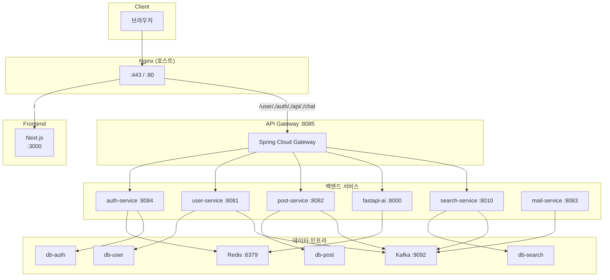
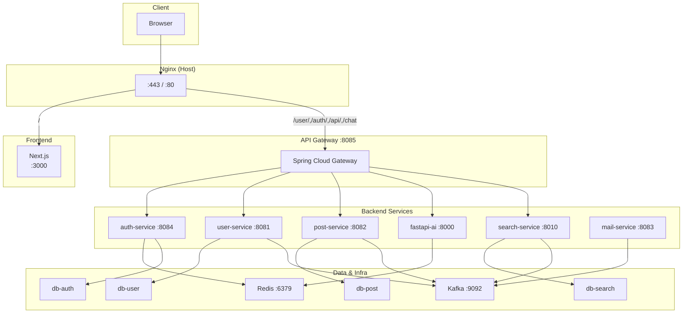

<a name="top"></a>

# MSA 블로그 플랫폼

**문서 언어 선택 | Select language:** [한글 (kor)](#kor) · [English (eng)](#eng)

---

<a name="kor"></a>

# 🇰🇷 한글 버전

## 데이터 구조

| 데이터베이스 | 컨테이너 | 용도 |
|-------------|----------|------|
| **Auth DB** | `msa-db-auth` (PostgreSQL 15) | 인증·권한, 관리자, OAuth2 연동 정보 |
| **User DB** | `msa-db-user` (PostgreSQL 15) | 사용자 프로필·정보 |
| **Post DB** | `msa-db-post` (PostgreSQL 15) | 게시글, 댓글, 카테고리·태그 |
| **Search DB** | `msa-db-search` (pgvector/pg15) | 벡터 검색 인덱스 (sentence-transformers 임베딩) |

챗봇 대화·파일 등은 `data/chatbot` 디렉터리에 볼륨으로 저장됩니다.

---

## 아키텍처 구성도


```mermaid
flowchart TB
    subgraph Client
        Browser[브라우저]
    end
    subgraph Nginx["Nginx (호스트)"]
        N[":443 / :80"]
    end
    subgraph Frontend
        Next["Next.js\n:3000"]
    end
    subgraph Gateway["API Gateway :8085"]
        GW[Spring Cloud Gateway]
    end
    subgraph Backend["백엔드 서비스"]
        Auth[auth-service :8084]
        User[user-service :8081]
        Post[post-service :8082]
        AI[fastapi-ai :8000]
        Search[search-service :8010]
        Mail[mail-service :8083]
    end
    subgraph Data["데이터·인프라"]
        Redis[Redis :6379]
        Kafka[Kafka :9092]
        DBA[db-auth]
        DBU[db-user]
        DBP[db-post]
        DBS[db-search]
    end
    Browser --> N
    N -->|"/"| Next
    N -->|"/user/,/auth/,/api/,/chat"| GW
    GW --> Auth
    GW --> User
    GW --> Post
    GW --> AI
    GW --> Search
    Auth --> Redis
    Auth --> DBA
    User --> DBU
    User --> Kafka
    Post --> DBP
    Post --> Kafka
    AI --> Redis
    Search --> DBS
    Search --> Kafka
    Mail --> Kafka
```

---

## 시스템 아키텍처

- **단일 진입점**: Nginx → API Gateway(Spring Cloud Gateway). 모든 API는 Gateway를 거쳐 JWT 검증·Trace ID 부여 후 각 마이크로서비스로 라우팅됩니다.
- **프론트엔드**: Next.js 14 (App Router). Nginx에서 `/`는 Next.js(3000)로 직접 프록시됩니다.
- **이벤트 드리븐**: 회원가입·게시글 등 이벤트는 Kafka로 발행되며, Mail 서비스·Search 인덱싱 등이 구독합니다.
- **인프라**: Redis(캐시·Refresh Token·랭킹), Kafka(KRaft 단일 노드), PostgreSQL 4종(서비스별 DB 분리).

---

## 프로젝트 구조

```
my-msa-project-new/
├── backend/
│   ├── gateway-service/   # Spring Cloud Gateway (JWT, 라우팅)
│   ├── auth-service/      # 로그인·회원가입·OAuth2·JWT
│   ├── user-service/      # 사용자 프로필
│   ├── post-service/      # 게시글·댓글
│   ├── smtp-service/      # Kafka 수신 → 이메일 발송
│   ├── fastapi-ai/        # AI 챗봇 (LangChain, Groq)
│   └── search-service/    # FastAPI + pgvector 벡터 검색
├── frontend/
│   └── nextjs-app/        # Next.js 14 앱
├── nginx/                 # Nginx 설정 (별도 저장소/폴더)
│   ├── sites-available/
│   └── sites-enabled/
├── monitoring/            # Loki Stack (Fluent Bit, Loki, Grafana)
├── docs/                  # 프로젝트·Nginx 문서
├── data/                  # DB·챗봇 볼륨 마운트
├── docker-compose.yml     # 메인 오케스트레이션
└── .env.example           # 환경 변수 템플릿
```

---

## 요청 흐름

1. **사용자** → Nginx(HTTPS) → 경로에 따라 분기  
2. **`/`** → Next.js(3000): 페이지·정적 자산  
3. **`/user/`, `/auth/`, `/api/posts`, `/api/search`, `/chat`** → API Gateway(8085)  
4. **Gateway** → JWT 검증(해당 경로) · Trace ID 부여 → 해당 서비스로 프록시  
   - `/user/**` → user-service:8081  
   - `/auth/**` → auth-service:8084  
   - `/api/posts/**` → post-service:8082  
   - `/api/search/**` → search-service:8010  
   - `/chat/**` → fastapi-ai:8000  
5. **서비스** → 각 DB·Redis·Kafka 사용 후 응답 → Gateway → Nginx → 클라이언트

---

## Nginx 라우팅

Nginx 설정은 **`nginx/`** 디렉터리에 있으며, 운영은 `sites-available/msa-project`(활성: `sites-enabled/msa-project`)를 사용합니다.

| location | 프록시 대상 | 비고 |
|----------|-------------|------|
| `location /` | `http://127.0.0.1:3000` | Next.js |
| `location /user/` | `http://msa-gateway` (127.0.0.1:8085) | Gateway → user-service |
| `location /auth/` | `http://msa-gateway` | Gateway → auth-service |
| `location /api/posts` | `http://msa-gateway` | Gateway → post-service |
| `location /api/search` | `http://msa-gateway` | Gateway → search-service |
| `location /chat` | `http://msa-gateway` | AI 챗봇 (타임아웃 600s) |
| `location /actuator` | `http://msa-gateway` | 헬스체크·백오피스 |
| `location /grafana/` | `http://127.0.0.1:3001` | Grafana (monitoring 프로파일) |

- 업스트림: `upstream msa-gateway { server 127.0.0.1:8085 max_fails=2 fail_timeout=30s; keepalive 8; }`
- 개발 도메인 `dev.minkowskim.com`: `/` → 4000, API·auth·user·chat → 9085(Gateway).

자세한 설명은 `docs/nginx-aws-lightsail.md`를 참고하세요.

---

## API 명세

Gateway 경로와 백엔드 서비스 매핑(운영: `application-prod.yml` 기준)은 다음과 같습니다.

| 경로 | 서비스 | 설명 |
|------|--------|------|
| `/user`, `/user/**` | user-service:8081 | 사용자 프로필·정보 |
| `/auth`, `/auth/**` | auth-service:8084 | 로그인·회원가입·OAuth2·JWT·인증 메일 |
| `/api/posts`, `/api/posts/**` | post-service:8082 | 게시글·댓글 CRUD |
| `/chat`, `/chat/**` | fastapi-ai:8000 | AI 챗봇 (SSE/스트리밍) |
| `/api/search`, `/api/search/**` | search-service:8010 | 벡터·키워드 검색 |

인증이 필요한 API는 `Authorization: Bearer <JWT>` 또는 쿠키(`authToken`)로 전달합니다. 상세 엔드포인트는 각 서비스 소스 및 Gateway 설정을 참고하세요.

---

## 빠른 시작

### 요구 사항

- Docker, Docker Compose
- (선택) Nginx 설치 및 `nginx/` 설정 배치

### 실행

```bash
# 1. 환경 변수 설정
cp .env.example .env
# .env 내 DB 비밀번호, JWT_SECRET, OAuth2, GROQ_API_KEY 등 수정

# 2. 전체 스택 기동 (4GB 메모리 기준)
docker compose up -d

# 3. (선택) 모니터링 스택 기동
docker compose --profile monitoring up -d
```

- **프론트엔드**: http://localhost:3000  
- **API Gateway**: http://localhost:8085 (Nginx 사용 시 Nginx가 8085로 프록시)  
- **Grafana**(monitoring 프로파일): http://localhost:3001  

---

## 서비스 구성

| 서비스 | 포트 | 기술 스택 | 비고 |
|--------|------|-----------|------|
| api-gateway | 8085 | Spring Boot 3, Spring Cloud Gateway | JWT·Trace ID·라우팅 |
| auth-service | 8084 | Spring Boot, JPA, OAuth2, Redis, Kafka | 관리자 부트스트랩 |
| user-service | 8081 | Spring Boot, JPA, Kafka | |
| post-service | 8082 | Spring Boot, JPA, WebClient, Kafka | |
| mail-service | 8083 | Spring Boot, Kafka, Mail | Kafka 구독 → SMTP |
| fastapi-ai | 8000 | FastAPI, LangChain, Groq, Redis | 챗봇 |
| search-service | 8010 | FastAPI, pgvector, Kafka | 벡터 인덱싱 |
| frontend | 3000 | Next.js 14 | |
| redis | 6379 | Redis Alpine | |
| msa-kafka | 9092 | Apache Kafka 3.7 (KRaft) | |
| db-auth / db-user / db-post / db-search | 5434/5432/5433/5435 | PostgreSQL 15, pgvector | |

---

## 백오피스·모니터링

- **백오피스**: Next.js `/backoffice` 페이지에서 관리 기능 제공. Gateway `/actuator`로 헬스체크 가능.
- **모니터링**: `docker compose --profile monitoring up -d` 로 Fluent Bit → Loki → Grafana 기동. Grafana는 Nginx에서 `/grafana/`로 접근 가능(설정 시 3001→프록시).
- **Kafka UI**(선택): `docker compose --profile tools up -d` 로 8080에서 Kafka UI 사용 가능.

---

## 환경 변수

`.env.example`을 복사해 `.env`를 만들고 아래 항목을 채웁니다.

| 구분 | 주요 변수 |
|------|-----------|
| DB | `POSTGRES_USER`, `POSTGRES_PASSWORD`, `DB_AUTH_NAME`, `DB_USER_NAME`, `DB_POST_NAME`, `DB_SEARCH_NAME` |
| JWT·관리자 | `JWT_SECRET`, `ADMIN_USERNAME`, `ADMIN_PASSWORD` |
| OAuth2 | `OAUTH2_GOOGLE_*`, `OAUTH2_KAKAO_*`, `COOKIE_DOMAIN`, `FRONTEND_URL` |
| Redis·Kafka | `SPRING_REDIS_HOST`, `REDIS_*`, `SPRING_KAFKA_BOOTSTRAP_SERVERS` |
| SMTP | `MAIL_USERNAME`, `MAIL_PASSWORD` |
| AI | `GROQ_API_KEY` |
| 프론트 빌드 시 | `NEXT_PUBLIC_API_URL`, `NEXT_PUBLIC_AUTH_API_URL`, `NEXT_PUBLIC_*_API_URL` |
| 모니터링 | `GRAFANA_ADMIN_PASSWORD` |

---

## 참고 문서

| 문서 | 설명 |
|------|------|
| `docs/PROJECT_UPDATES.md` | 프로젝트 업데이트·변경 이력 |
| `docs/nginx-aws-lightsail.md` | Nginx 디렉터리 구조, 라우팅, SSL, Lightsail 참고 |
| `nginx/sites-available/msa-project` | 운영 Nginx 설정 파일 |
| `monitoring/docker-compose.monitoring.yml` | Loki Stack 모니터링 Compose |

---

[맨 위로](#top) · [English (eng)](#eng)

---

<a name="eng"></a>

# 🇬🇧 English Version

## Language

**Select language:** [한글 (kor)](#kor) · [English (eng)](#eng)

---

## Data Structure

| Database | Container | Purpose |
|----------|-----------|---------|
| **Auth DB** | `msa-db-auth` (PostgreSQL 15) | Authentication, authorization, admin, OAuth2 |
| **User DB** | `msa-db-user` (PostgreSQL 15) | User profiles and info |
| **Post DB** | `msa-db-post` (PostgreSQL 15) | Posts, comments, categories, tags |
| **Search DB** | `msa-db-search` (pgvector/pg15) | Vector search index (sentence-transformers embeddings) |

Chatbot conversations and files are stored under `data/chatbot` (volume).

---

## Architecture Diagram


```mermaid
flowchart TB
    subgraph Client
        Browser[Browser]
    end
    subgraph Nginx["Nginx (Host)"]
        N[":443 / :80"]
    end
    subgraph Frontend
        Next["Next.js\n:3000"]
    end
    subgraph Gateway["API Gateway :8085"]
        GW[Spring Cloud Gateway]
    end
    subgraph Backend["Backend Services"]
        Auth[auth-service :8084]
        User[user-service :8081]
        Post[post-service :8082]
        AI[fastapi-ai :8000]
        Search[search-service :8010]
        Mail[mail-service :8083]
    end
    subgraph Data["Data & Infra"]
        Redis[Redis :6379]
        Kafka[Kafka :9092]
        DBA[db-auth]
        DBU[db-user]
        DBP[db-post]
        DBS[db-search]
    end
    Browser --> N
    N -->|"/"| Next
    N -->|"/user/,/auth/,/api/,/chat"| GW
    GW --> Auth
    GW --> User
    GW --> Post
    GW --> AI
    GW --> Search
    Auth --> Redis
    Auth --> DBA
    User --> DBU
    User --> Kafka
    Post --> DBP
    Post --> Kafka
    AI --> Redis
    Search --> DBS
    Search --> Kafka
    Mail --> Kafka
```

---

## System Architecture

- **Single entry point**: Nginx → API Gateway (Spring Cloud Gateway). All API traffic is validated (JWT), tagged with Trace ID, then routed to microservices.
- **Frontend**: Next.js 14 (App Router). Nginx proxies `/` to Next.js on port 3000.
- **Event-driven**: User/post events are published to Kafka; Mail and Search services consume them.
- **Infrastructure**: Redis (cache, refresh tokens, rankings), Kafka (KRaft single node), four PostgreSQL instances (one per domain).

---

## Project Structure

```
my-msa-project-new/
├── backend/
│   ├── gateway-service/   # Spring Cloud Gateway (JWT, routing)
│   ├── auth-service/      # Login, signup, OAuth2, JWT
│   ├── user-service/      # User profiles
│   ├── post-service/      # Posts, comments
│   ├── smtp-service/      # Kafka → email (SMTP)
│   ├── fastapi-ai/        # AI chatbot (LangChain, Groq)
│   └── search-service/    # FastAPI + pgvector search
├── frontend/
│   └── nextjs-app/        # Next.js 14 app
├── nginx/                 # Nginx config (separate folder)
│   ├── sites-available/
│   └── sites-enabled/
├── monitoring/            # Loki Stack (Fluent Bit, Loki, Grafana)
├── docs/                  # Project and Nginx docs
├── data/                  # DB and chatbot volumes
├── docker-compose.yml     # Main orchestration
└── .env.example           # Environment template
```

---

## Request Flow

1. **User** → Nginx (HTTPS) → path-based routing.
2. **`/`** → Next.js (3000): pages and static assets.
3. **`/user/`, `/auth/`, `/api/posts`, `/api/search`, `/chat`** → API Gateway (8085).
4. **Gateway** → JWT validation (where applicable), Trace ID → proxy to service:
   - `/user/**` → user-service:8081  
   - `/auth/**` → auth-service:8084  
   - `/api/posts/**` → post-service:8082  
   - `/api/search/**` → search-service:8010  
   - `/chat/**` → fastapi-ai:8000  
5. **Services** → DB / Redis / Kafka → response → Gateway → Nginx → client.

---

## Nginx Routing

Nginx configuration lives under **`nginx/`**. Production uses `sites-available/msa-project` (enabled via `sites-enabled/msa-project`).

| location | Proxy target | Notes |
|----------|--------------|-------|
| `location /` | `http://127.0.0.1:3000` | Next.js |
| `location /user/` | `http://msa-gateway` (127.0.0.1:8085) | Gateway → user-service |
| `location /auth/` | `http://msa-gateway` | Gateway → auth-service |
| `location /api/posts` | `http://msa-gateway` | Gateway → post-service |
| `location /api/search` | `http://msa-gateway` | Gateway → search-service |
| `location /chat` | `http://msa-gateway` | AI chatbot (timeout 600s) |
| `location /actuator` | `http://msa-gateway` | Health checks, back office |
| `location /grafana/` | `http://127.0.0.1:3001` | Grafana (monitoring profile) |

- Upstream: `upstream msa-gateway { server 127.0.0.1:8085 max_fails=2 fail_timeout=30s; keepalive 8; }`
- Dev domain `dev.minkowskim.com`: `/` → 4000, API/auth/user/chat → 9085 (Gateway).

See `docs/nginx-aws-lightsail.md` for details.

---

## API Specification

Gateway path to backend mapping (production: `application-prod.yml`):

| Path | Service | Description |
|------|---------|-------------|
| `/user`, `/user/**` | user-service:8081 | User profile and info |
| `/auth`, `/auth/**` | auth-service:8084 | Login, signup, OAuth2, JWT, verification email |
| `/api/posts`, `/api/posts/**` | post-service:8082 | Post and comment CRUD |
| `/chat`, `/chat/**` | fastapi-ai:8000 | AI chatbot (SSE/streaming) |
| `/api/search`, `/api/search/**` | search-service:8010 | Vector and keyword search |

Protected APIs use `Authorization: Bearer <JWT>` or cookie `authToken`. For endpoint details, see each service and Gateway config.

---

## Quick Start

### Requirements

- Docker and Docker Compose
- (Optional) Nginx with config from `nginx/`

### Run

```bash
# 1. Environment
cp .env.example .env
# Edit .env: DB passwords, JWT_SECRET, OAuth2, GROQ_API_KEY, etc.

# 2. Start full stack (4GB memory oriented)
docker compose up -d

# 3. (Optional) Monitoring
docker compose --profile monitoring up -d
```

- **Frontend**: http://localhost:3000  
- **API Gateway**: http://localhost:8085 (or via Nginx)  
- **Grafana** (monitoring profile): http://localhost:3001  

---

## Service Composition

| Service | Port | Stack | Notes |
|---------|------|-------|-------|
| api-gateway | 8085 | Spring Boot 3, Spring Cloud Gateway | JWT, Trace ID, routing |
| auth-service | 8084 | Spring Boot, JPA, OAuth2, Redis, Kafka | Admin bootstrap |
| user-service | 8081 | Spring Boot, JPA, Kafka | |
| post-service | 8082 | Spring Boot, JPA, WebClient, Kafka | |
| mail-service | 8083 | Spring Boot, Kafka, Mail | Kafka → SMTP |
| fastapi-ai | 8000 | FastAPI, LangChain, Groq, Redis | Chatbot |
| search-service | 8010 | FastAPI, pgvector, Kafka | Vector indexing |
| frontend | 3000 | Next.js 14 | |
| redis | 6379 | Redis Alpine | |
| msa-kafka | 9092 | Apache Kafka 3.7 (KRaft) | |
| db-auth / db-user / db-post / db-search | 5434/5432/5433/5435 | PostgreSQL 15, pgvector | |

---

## Back Office & Monitoring

- **Back office**: Next.js `/backoffice`; Gateway `/actuator` for health.
- **Monitoring**: `docker compose --profile monitoring up -d` runs Fluent Bit → Loki → Grafana. Grafana is exposed via Nginx at `/grafana/` (proxy to 3001).
- **Kafka UI** (optional): `docker compose --profile tools up -d` exposes Kafka UI on 8080.

---

## Environment Variables

Copy `.env.example` to `.env` and set:

| Category | Variables |
|----------|-----------|
| DB | `POSTGRES_USER`, `POSTGRES_PASSWORD`, `DB_AUTH_NAME`, `DB_USER_NAME`, `DB_POST_NAME`, `DB_SEARCH_NAME` |
| JWT & Admin | `JWT_SECRET`, `ADMIN_USERNAME`, `ADMIN_PASSWORD` |
| OAuth2 | `OAUTH2_GOOGLE_*`, `OAUTH2_KAKAO_*`, `COOKIE_DOMAIN`, `FRONTEND_URL` |
| Redis & Kafka | `SPRING_REDIS_HOST`, `REDIS_*`, `SPRING_KAFKA_BOOTSTRAP_SERVERS` |
| SMTP | `MAIL_USERNAME`, `MAIL_PASSWORD` |
| AI | `GROQ_API_KEY` |
| Frontend build | `NEXT_PUBLIC_API_URL`, `NEXT_PUBLIC_*_API_URL` |
| Monitoring | `GRAFANA_ADMIN_PASSWORD` |

---

## References

| Document | Description |
|----------|-------------|
| `docs/PROJECT_UPDATES.md` | Project update and change history |
| `docs/nginx-aws-lightsail.md` | Nginx layout, routing, SSL, Lightsail |
| `nginx/sites-available/msa-project` | Production Nginx config |
| `monitoring/docker-compose.monitoring.yml` | Loki Stack monitoring Compose |

---

[Back to top](#top) · [한글 (kor)](#kor)
