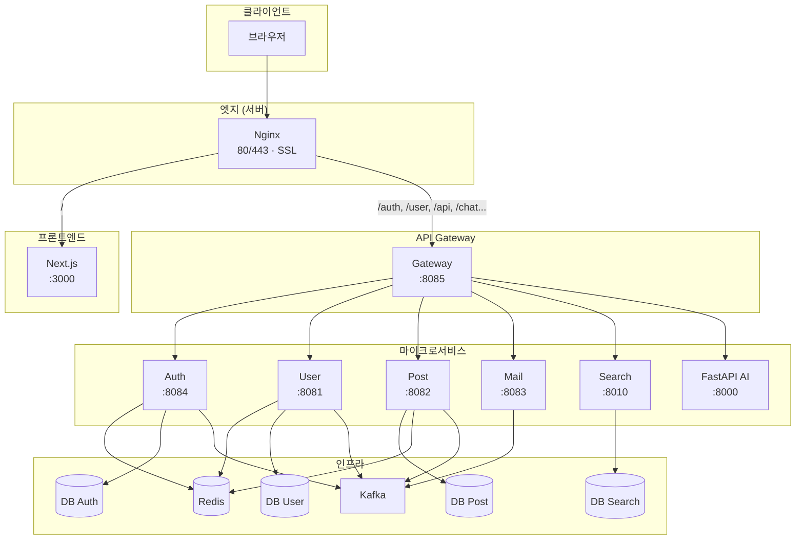
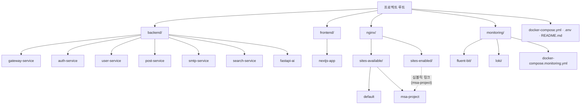
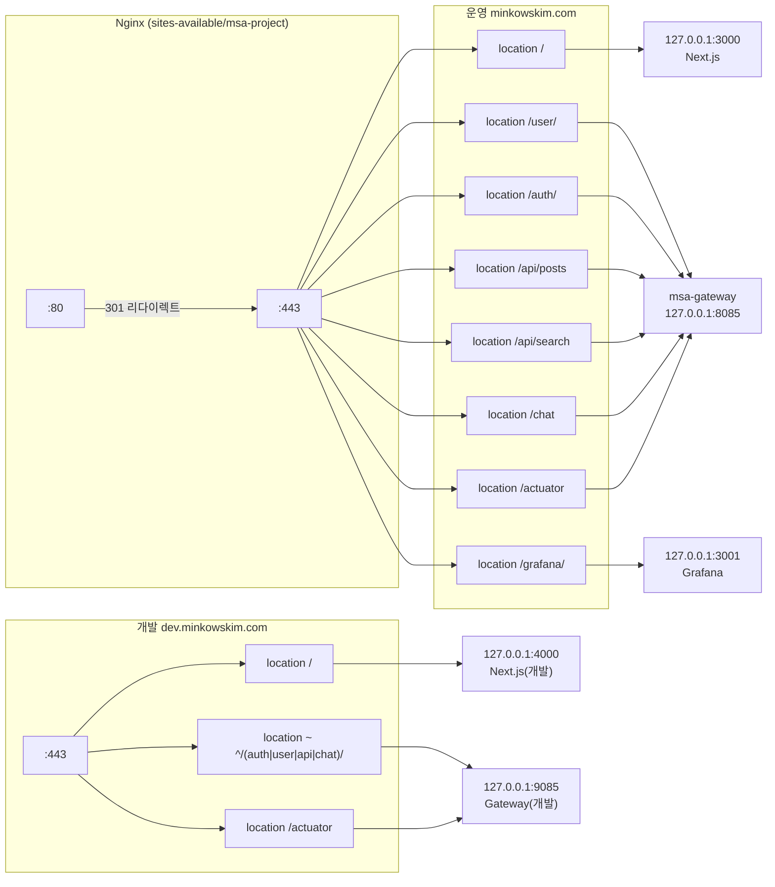

# MinKowskiM — MSA 블로그 플랫폼

백엔드·프론트엔드·AI를 아우르는 **마이크로서비스 블로그** 프로젝트입니다.  
API Gateway, Auth/User/Post/Search/Mail/AI 서비스, Next.js 프론트엔드, Redis·Kafka·PostgreSQL로 구성되며, **Nginx**로 리버스 프록시·SSL·라우팅을 담당합니다.

---

## 목차

- [기술 스택](#기술-스택)
- [프로젝트 구조](#프로젝트-구조)
- [Nginx 설정](#nginx-설정)
- [빠른 시작](#빠른-시작)
- [백오피스·모니터링 활용 가이드](#백오피스모니터링-활용-가이드)
- [서비스 구성](#서비스-구성)
- [환경 변수](#환경-변수)
- [참고 문서](#참고-문서)
- [API 명세서](#api-명세서)

---

## 기술 스택

| 구분 | 기술 |
|------|------|
| **프론트엔드** | Next.js 14, React 18, Axios |
| **백엔드** | Spring Boot (Gateway, Auth, User, Post, Mail), FastAPI (Search, AI 챗봇) |
| **인프라** | Docker Compose, Nginx, Redis, Apache Kafka (KRaft), PostgreSQL (pgvector) |
| **모니터링** | Grafana, Loki, Fluent Bit |
| **배포** | Nginx 리버스 프록시, Let's Encrypt SSL |

---

## 프로젝트 구조

```
├── backend/
│   ├── gateway-service/   # API Gateway (JWT·Trace ID·라우팅)
│   ├── auth-service/      # 인증 (로그인·회원가입·OAuth2)
│   ├── user-service/      # 사용자 정보
│   ├── post-service/      # 게시글·댓글·카테고리·태그
│   ├── smtp-service/      # 메일 발송 (Kafka 소비)
│   ├── search-service/    # 검색 (FastAPI + pgvector)
│   └── fastapi-ai/        # 챗봇 (FastAPI)
├── frontend/
│   └── nextjs-app/        # Next.js 블로그 UI
├── nginx/
│   ├── sites-available/   # 사이트 설정 (활성화 시 sites-enabled로 심볼릭 링크)
│   │   ├── default        # 기본 Nginx 설정
│   │   └── msa-project    # 운영·개발 도메인 (minkowskim.com, dev.minkowskim.com)
│   └── sites-enabled/     # 활성화된 사이트 (msa-project 링크)
├── monitoring/            # Loki·Fluent Bit·Grafana 설정
├── docker-compose.yml
├── .env.example
└── README.md
```

### 시스템 아키텍처 (요청 흐름)


```mermaid
flowchart TB
    subgraph Client["클라이언트"]
        Browser[브라우저]
    end

    subgraph Edge["엣지 (서버)"]
        Nginx[Nginx\n80/443 · SSL]
    end

    subgraph Front["프론트엔드"]
        Next[Next.js\n:3000]
    end

    subgraph Gateway["API Gateway"]
        GW[Gateway\n:8085]
    end

    subgraph Backend["마이크로서비스"]
        Auth[Auth\n:8084]
        User[User\n:8081]
        Post[Post\n:8082]
        Mail[Mail\n:8083]
        Search[Search\n:8010]
        AI[FastAPI AI\n:8000]
    end

    subgraph Infra["인프라"]
        Redis[(Redis)]
        Kafka[Kafka]
        DBA[(DB Auth)]
        DBU[(DB User)]
        DBP[(DB Post)]
        DBS[(DB Search)]
    end

    Browser --> Nginx
    Nginx -->|"/"| Next
    Nginx -->|"/auth, /user, /api, /chat..."| GW
    GW --> Auth
    GW --> User
    GW --> Post
    GW --> Mail
    GW --> Search
    GW --> AI
    Auth --> Redis
    Auth --> DBA
    User --> Redis
    User --> DBU
    Post --> DBP
    Post --> Redis
    Search --> DBS
    Auth --> Kafka
    User --> Kafka
    Post --> Kafka
    Mail --> Kafka
```

### 프로젝트 디렉터리 구조 (코드베이스)


```mermaid
flowchart TB
    ROOT["프로젝트 루트"]

    ROOT --> BACK["backend/"]
    ROOT --> FRONT["frontend/"]
    ROOT --> NGINX["nginx/"]
    ROOT --> MON["monitoring/"]
    ROOT --> FILES["docker-compose.yml · .env · README.md"]

    BACK --> GW["gateway-service"]
    BACK --> AUTH["auth-service"]
    BACK --> USER["user-service"]
    BACK --> POST["post-service"]
    BACK --> SMTP["smtp-service"]
    BACK --> SEARCH["search-service"]
    BACK --> FA["fastapi-ai"]

    FRONT --> NEXT["nextjs-app"]

    NGINX --> AVAIL["sites-available/"]
    NGINX --> ENBL["sites-enabled/"]
    AVAIL --> DEFAULT["default"]
    AVAIL --> MSA["msa-project"]
    ENBL -.->|"심볼릭 링크\n(msa-project)"| MSA

    MON --> FB["fluent-bit/"]
    MON --> LOKI["loki/"]
    MON --> DCMON["docker-compose.monitoring.yml"]
```

### Nginx 라우팅 구조 (`nginx/sites-available/msa-project` 기준)


```mermaid
flowchart LR
    subgraph Nginx["Nginx (sites-available/msa-project)"]
        direction TB
        HTTP80[":80"]
        HTTPS443[":443"]
    end

    subgraph Prod["운영 minkowskim.com"]
        HTTP80 -->|301 리다이렉트| HTTPS443
        HTTPS443 --> L["location /"]
        HTTPS443 --> U["location /user/"]
        HTTPS443 --> A["location /auth/"]
        HTTPS443 --> P["location /api/posts"]
        HTTPS443 --> S["location /api/search"]
        HTTPS443 --> C["location /chat"]
        HTTPS443 --> ACT["location /actuator"]
        HTTPS443 --> G["location /grafana/"]
    end

    subgraph Dev["개발 dev.minkowskim.com"]
        D443[":443"]
        D443 --> D_ROOT["location /"]
        D443 --> D_API["location ~ ^/(auth|user|api|chat)/"]
        D443 --> D_ACT["location /actuator"]
    end

    L --> FE["127.0.0.1:3000\nNext.js"]
    U --> GW["msa-gateway\n127.0.0.1:8085"]
    A --> GW
    P --> GW
    S --> GW
    C --> GW
    ACT --> GW
    G --> GRAF["127.0.0.1:3001\nGrafana"]

    D_ROOT --> FE_DEV["127.0.0.1:4000\nNext.js(개발)"]
    D_API --> GW_DEV["127.0.0.1:9085\nGateway(개발)"]
    D_ACT --> GW_DEV
```

---

## Nginx 설정

프로젝트의 **Nginx** 설정은 `nginx/sites-available/` 에 있으며, 실제 사용 시 `sites-enabled` 에 심볼릭 링크를 걸어 활성화합니다.

### 파일 구성

| 파일 | 설명 |
|------|------|
| `nginx/sites-available/default` | Nginx 기본 사이트 설정 |
| `nginx/sites-available/msa-project` | **MSA 블로그용 메인 설정** (운영·개발 도메인) |

### msa-project 주요 동작

- **운영 도메인** (`minkowskim.com`, `www.minkowskim.com`)
  - **80 → 443** HTTP to HTTPS 리다이렉트
  - **SSL**: Let's Encrypt 인증서 (`/etc/letsencrypt/live/...`)
  - **`/`** → Next.js 프론트엔드 (`127.0.0.1:3000`)
  - **`/user/`, `/auth/`, `/api/posts`, `/api/search`, `/chat`, `/actuator`** → API Gateway (`127.0.0.1:8085`)
  - **`/grafana/`** → Grafana (`127.0.0.1:3001`)
- **개발 도메인** (`dev.minkowskim.com`)
  - **`/`** → 개발용 Next.js (`127.0.0.1:4000`)
  - **`/auth`, `/user`, `/api`, `/chat`, `/actuator`** → 개발용 Gateway (`127.0.0.1:9085`)

### 서버에 적용 방법

```bash
# 설정 테스트
sudo nginx -t

# sites-enabled에 심볼릭 링크 생성 (예: Ubuntu/Debian)
sudo ln -sf /path/to/project/nginx/sites-available/msa-project /etc/nginx/sites-enabled/

# Nginx 재로드
sudo systemctl reload nginx
```

> 실제 배포 시 `server_name`, SSL 인증서 경로, upstream 포트는 환경에 맞게 수정해야 합니다.

---

## 빠른 시작

### 1. 환경 설정

```bash
cp .env.example .env
# .env 에 DB 비밀번호, JWT_SECRET, OAuth2, SMTP, GROQ_API_KEY 등 채우기
```

### 2. 전체 서비스 기동

```bash
docker compose up -d
```

- **프론트엔드**: http://localhost:3000 (또는 배포 도메인)
- **API Gateway**: http://localhost:8085

### 3. 선택 기동 (프로파일)

| 목적           | 명령어                                      |
|----------------|---------------------------------------------|
| 모니터링 스택  | `docker compose --profile monitoring up -d` |
| Kafka UI       | `docker compose --profile tools up -d`      |

---

## 백오피스·모니터링 활용 가이드

> **어디서 뭘 봐야 할지 감이 안 잡힐 때** 이 섹션을 따라가면 됩니다.

### 1. 백오피스 화면 (관리자·헬스 체크)

**접속 방법**

- **로컬**: http://localhost:3000/backoffice  
- **운영**: https://minkowskim.com/backoffice  

**무엇을 하나요?**

- **시스템 동작 상태** 테이블에서 **Gateway / Post / Search / Chat** 서비스가 **정상(UP)** 인지 한눈에 확인합니다.
- 모두 Gateway를 거쳐 실제 API를 호출해서 확인하므로, “사이트는 되는데 특정 기능만 안 될 때” 어느 서비스 쪽인지 빠르게 짚을 수 있습니다.

### 2. 모니터링 (Grafana + Loki)

```bash
docker compose --profile monitoring up -d
```

- **로컬**: http://localhost:3001  
- **운영**: https://minkowskim.com/grafana  

Grafana **Explore** → 데이터 소스 **Loki** → `{container_name="msa-gateway"}` 등으로 로그 조회.

### 3. 한 번에 정리

| 목적 | 위치 |
|------|------|
| 서비스 UP/DOWN 확인 | **백오피스** (`/backoffice`) |
| 로그·에러 확인 | **Grafana** (`/grafana`) → Explore → Loki |
| Kafka 토픽 확인 (선택) | `--profile tools` 후 Kafka UI (8080) |

---

## 서비스 구성

| 서비스        | 포트  | 역할                          |
|---------------|-------|-------------------------------|
| api-gateway   | 8085  | 단일 진입점, JWT 검증, 라우팅 |
| auth-service  | 8084  | 로그인·회원가입·OAuth2       |
| user-service  | 8081  | 사용자 정보                   |
| post-service  | 8082  | 게시글·댓글·카테고리·태그    |
| mail-service  | 8083  | SMTP 메일 (Kafka 소비)       |
| search-service| 8010  | 검색 (pgvector)               |
| fastapi-ai    | 8000  | 챗봇                         |
| frontend      | 3000  | Next.js                      |
| redis         | 6379  | 캐시·세션·조회수              |
| msa-kafka     | 9092  | 이벤트·메일 큐               |
| db-auth/user/post/search | 5432–5435 | PostgreSQL |

---

## 환경 변수

`.env.example`을 복사해 `.env`를 만든 뒤 아래 항목을 채웁니다.

- **DB**: `POSTGRES_USER`, `POSTGRES_PASSWORD`, 각 DB 이름
- **JWT**: `JWT_SECRET`
- **OAuth2**: Google/Kakao 클라이언트 ID·Secret, `COOKIE_DOMAIN`, `FRONTEND_URL`
- **Redis**: `SPRING_REDIS_HOST`, `REDIS_HOST`, `REDIS_PORT`
- **Kafka**: `SPRING_KAFKA_BOOTSTRAP_SERVERS`
- **SMTP**: `MAIL_USERNAME`, `MAIL_PASSWORD`
- **AI**: `GROQ_API_KEY`
- **프론트**: `NEXT_PUBLIC_API_URL`, `NEXT_PUBLIC_POST_API_URL`, `NEXT_PUBLIC_CHATBOT_API_URL`
- **모니터링(선택)**: `GRAFANA_ADMIN_PASSWORD`

---

## 참고 문서

- [**docs/API_SPEC.md**](docs/API_SPEC.md) — **API 명세서** (Auth·User·Post·Comment·Search·Chat 엔드포인트, Nginx 경로 기준)
- `../docs/nginx_부터_시스템_실행_최종_점검.md` — Nginx·쿠키·라우팅 점검
- `../docs/Nginx_운영_라우팅_설명.md` — Nginx 라우팅 상세
- `../docs/DEPLOY_LIGHTSAIL.md` — AWS Lightsail 배포

---

## API 명세서

백엔드 컨트롤러와 **nginx/sites-available/msa-project** 노출 경로를 기준으로 한 API 명세는 **[docs/API_SPEC.md](docs/API_SPEC.md)** 에 정리되어 있습니다.

- Auth (`/auth/**`), User (`/user/**`), Post·Comment (`/api/posts`, `/api/posts/**`), Search (`/api/search`), Chat (`/chat`) 메서드·경로·요청/응답 예시
- Nginx location별 프록시 대상 요약

---

이 README와 **Nginx 설정**, **백오피스·모니터링** 섹션만 따라가도, 프로젝트 구성과 “지금 상태를 어디서 보고, 문제가 생기면 로그를 어디서 보면 되는지” 흐름을 잡을 수 있습니다.
