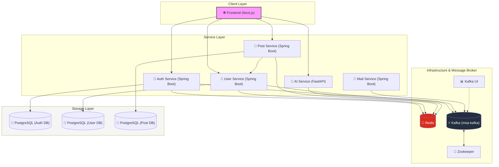

# 🚀 MSA 기반 풀스택 커뮤니티 & AI 플랫폼

### 📱 Frontend

### ⚙️ Backend

### 🗄️ Database & Cache

### 📨 Message Broker

### 🤖 AI & LLM

### ☁️ Infrastructure & DevOps

> **MSA(Microservice Architecture)**를 기반으로 설계된 고효율 시스템입니다.
> 도메인별 최적화된 프레임워크 선택과 보안 강화, 그리고 실시간 AI 챗봇 기능을 제공합니다.

🔗 **라이브 데모**: [https://minkowskim.com/](https://minkowskim.com/)

---

## 🏗️ System Architecture

본 프로젝트는 서비스 간 결합도를 낮추고 확장성을 높이기 위해 마이크로서비스 구조로 설계되었습니다.

- **Frontend**: Next.js (SEO 최적화 및 테마 시스템)
- **User Service**: Spring Boot (인증 및 보안)
- **Post Service**: Spring Boot (게시글 관리)
- **Mail Service**: Spring Boot (메일 관리)
- **Chatbot Service**: FastAPI (AI 챗봇 엔진)
- **Infrastructure**: AWS Lightsail, Docker, Nginx

---

# 🏗️ System Architecture

프로젝트의 전체적인 마이크로서비스 구조 및 데이터 흐름도입니다.

---

## 🏛️ Architecture Diagram

## 🔥 Key Features

### 1. 보안 강화 유저 시스템 (User Domain)

- **Spring Boot & JWT**: JSON Web Token을 활용한 안전한 인증 체계.
- **HttpOnly Cookie**: 모든 로그인 및 토큰 시스템을 `HttpOnly` 설정으로 구축하여 XSS 공격으로부터 보안을 강화했습니다.

### 2. AI 챗봇 서비스 (Chatbot Domain)

- **FastAPI**: 빠르고 효율적인 비동기 처리 기반 AI 서버.
- **Redis 연동**: Redis를 활용하여 사용자의 이전 대화 기록을 저장하고 맥락이 끊기지 않는 이어가기 기능을 제공합니다.

### 3. 고성능 프론트엔드 (Frontend)

- **Next.js**: SSR/SSG를 통한 **SEO(검색 엔진 최적화)** 구현.
- **다크 모드 & 화이트 모드**: 전 페이지 테마 전환 시스템 도입으로 UX 최적화.
- **Responsive UI**: 모든 기기에 대응하는 반응형 디자인.

### 4. 배포 및 인프라 (DevOps)

- **Containerization**: Docker 및 Docker Compose를 활용하여 서비스 독립성 및 배포 편의성 확보.
- **Nginx**: 리버스 프록시 및 로드 밸런싱 역할 수행.
- **AWS Lightsail**: 클라우드 인프라를 통한 실제 운영 환경 배포.

---

## 🛠 Tech Stack

| 구분                         | 기술 스택                                            |
| :--------------------------- | :--------------------------------------------------- |
| **Frontend**                 | `Next.js`, `Tailwind CSS`, `Lucide React`            |
| **Backend (Auth/Post/Mail)** | `Java`, `Spring Boot`, `Spring Security`, `JPA`      |
| **Backend (AI)**             | `Python`, `FastAPI`, `OpenAI API/LangChain`          |
| **Database/Cache**           | `H2/SQLite/PostgreSQL`, `Redis`, `Kafka`             |
| **DevOps**                   | `Docker`, `Docker Compose`, `Nginx`, `AWS Lightsail` |

## 📑 API Specification

본 프로젝트는 MSA 구조에 따라 3개의 주요 API 서버로 구성되어 있습니다.

### 1. User Service (Spring Boot)

- **Base URL**: `도메인/user`
- **Authentication**: JWT 기반 `HttpOnly` Cookie (`authToken`)

| 기능                 | 메서드 | 엔드포인트             | 파라미터 / Body        | 설명                       |
| :------------------- | :----: | :--------------------- | :--------------------- | :------------------------- |
| **로그인**           | `POST` | `/signin`              | `username`, `password` | 인증 후 JWT 쿠키 발급      |
| **회원가입**         | `POST` | `/signup`              | `SignupRequest` DTO    | 신규 유저 생성             |
| **로그아웃**         | `POST` | `/logout`              | -                      | `authToken` 쿠키 제거      |
| **내 정보 조회**     | `GET`  | `/me`                  | `userId` (Query)       | 현재 로그인 유저 정보 반환 |
| **ID 중복 체크**     | `GET`  | `/check-username`      | `username` (Query)     | 가입 가능 여부 확인        |
| **닉네임 중복 체크** | `GET`  | `/check-nickname`      | `nickname` (Query)     | 닉네임 사용 가능 여부      |
| **이메일 인증 발송** | `POST` | `/send-code`           | `email`                | 인증 코드 메일 발송        |
| **코드 검증**        | `POST` | `/verify-code`         | `email`, `code`        | 발송된 코드 일치 확인      |
| **벌크 닉네임 조회** | `POST` | `/api/users/nicknames` | `List<userIds>`        | ID 리스트로 닉네임 맵 반환 |

### 2. Post Service (Spring Boot)

- **Base URL**: `도메인/api/posts`

| 기능                 |  메서드  | 엔드포인트           | 설명                                       |
| :------------------- | :------: | :------------------- | :----------------------------------------- |
| **전체 게시글 조회** |  `GET`   | `/`                  | 페이징 처리된 게시글 목록 (`page`, `size`) |
| **카테고리별 조회**  |  `GET`   | `/category`          | 특정 카테고리 게시글 (`name` 파라미터)     |
| **태그별 조회**      |  `GET`   | `/tag`               | 특정 태그 게시글 (`name` 파라미터)         |
| **게시글 상세**      |  `GET`   | `/{id}`              | 게시글 상세 내용 조회                      |
| **게시글 작성**      |  `POST`  | `/`                  | 새 포스트 생성 (로그인 필수)               |
| **게시글 수정**      |  `PUT`   | `/{id}`              | 포스트 수정 (작성자 전용)                  |
| **게시글 삭제**      | `DELETE` | `/{id}`              | 포스트 삭제 (작성자 전용)                  |
| **카테고리 통계**    |  `GET`   | `/categories`        | 전체 카테고리 목록 및 게시글 수            |
| **태그 통계**        |  `GET`   | `/tags`              | 전체 태그 목록 및 사용 횟수                |
| **댓글 목록 조회**   |  `GET`   | `/{postId}/comments` | 특정 게시글의 전체 댓글 리스트             |
| **댓글 작성**        |  `POST`  | `/{postId}/comments` | 새 댓글 작성 (로그인 필수)                 |
| **댓글 수정**        |  `PUT`   | `/comments/{id}`     | 댓글 내용 수정                             |
| **댓글 삭제**        | `DELETE` | `/comments/{id}`     | 댓글 삭제                                  |

### 3. AI Chat Service (FastAPI)

- **Base URL**: `도메인/chat`

| 기능        | 메서드 | 엔드포인트 | 파라미터 / Body         | 설명                            |
| :---------- | :----: | :--------- | :---------------------- | :------------------------------ |
| **AI 채팅** | `POST` | `/chat`    | `session_id`, `message` | LLM 기반 대화 및 정보 저장 액션 |
